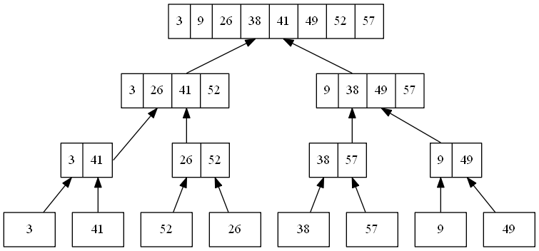

# 2.3 Designing algorithms
## 2.3-1


## 2.3-2
```
MERGE(A, p, q, r)

n1 = q - p + 1
n2 = r - q
let L[1..n1] and R[1..n2] be new arrays
for i = 1 to n1
    L[i] = A[p + i - 1]
for j = 1 to n2
    R[j] = A[q + j]
i = 1
j = 1
for k = p to r
    if i > n1:
        A[k] = R[j]
        j = j + 1
    else if j > n2:
        A[k] = L[i]
        i = i + 1
    else if L[i] <= R[j]:
        A[k] = L[i]
        i = i + 1
    else
        A[k] = R[j]
        j = j + 1
```

## 2.3-3
Because n is an exact power of 2, so the sequence of n is $2, 4, 8, 16, \ldots, 2^k$. First, let's see the base case, the base case is $n = 2$. And we have $T(n) = 2 = 2\lg{2}$. So the statement holds true for $n = 2$.

Second, let's see the inductive step. We assume $T(n) = n\lg{n}$ is true when $n = 2^k, k > 1$, and we want to prove it also holds true for the $n + 1$ element, which is $2^{k + 1}$.

When $n = 2^{k + 1}$, we have:

$$
\begin{eqnarray}
T(2^{k + 1}) &=& 2T(\frac{2^{k + 1}}{2}) + 2^{k + 1} \\\\\\
&=& 2T(2^k) + 2^{k + 1} \\\\\\
&=& 2 * 2^k\lg{2^k} + 2^{k + 1} \\\\\\
&=& 2^{k + 1}\lg{2^k} + 2^{k + 1} \\\\\\
&=& 2^{k + 1}(\lg{2^k} + 1) \\\\\\
&=& 2^{k + 1}(\lg{2^k} + \lg{2}) \\\\\\
&=& 2^{k + 1}\lg{2^{k + 1}}
\end{eqnarray}
$$

So $T(n) = n\lg{n}$ is true for all $n = 2^k, k \geq 1$.

## 2.3-4
The pseudocode would be like this:

```
INSERT(A, end)

key = A[end]
i = end - 1

while i > 0 and A[i] > key
    A[i + 1] = A[i]
    i = i - 1

A[i + 1] = key
```

```
RECURSIVE-INSERTION-SORT(A, end)

if end > 1:
    RECURSIVE-INSERTION-SORT(A, end - 1)
    INSERT(A, end)
```

And here is the recurrence for the running time (let $I(n)$ denotes the running time of inserting $A[n]$ to $A[1..n - 1]$):

$$
T(n) =
\begin{cases}
\Theta(1) & if\ n = 1, \\\\\\
T(n - 1) + I(n) & if\ n \geq 2
\end{cases}
$$

## 2.3-5
Pseudocode:

```
ITERATIVE-BINARY-SEARCH(A, v)

low = 1
high = n

while low <= high
    middle = (low + high) / 2

    if A[middle] < v
        low = middle + 1
    else if A[middle] > v
        high = middle - 1
    else
        return middle

return NIL
```

```
RECURSIVE-BINARY-SEARCH(A, v, low, high)

if low <= high
    middle = (low + high) / 2

    if A[middle] < v
        return RECURSIVE-BINARY-SEARCH(A, v, middle + 1, high)
    else if A[middle] > v
        return RECURSIVE-BINARY-SEARCH(A, v, low, middle - 1)
    else
        return middle

return NIL
```

From the pseudocode we can see either iterative or recursive binary search will halve the size of problem in each step when the middle element doesn't match the target value. So we have:

$$
T(n) =
\begin{cases}
C & if\ n = 1, \\\\\\
T(n / 2) + C & if\ n \geq 2
\end{cases}
$$

And we can rewrite $T(n)$ like:

$$
\begin{eqnarray}
T(n) &=& T(n / 2) + C \\\\\\
&=& T(n / 2^2) + C + C \\\\\\
&=& T(n / 2^3) + C + C + C \\\\\\
&=& ... \\\\\\
&=& T(1) + C\lg{n} \\\\\\
&=& C(\lg{n} + 1) \\\\\\
&=& \Theta(\lg{n})
\end{eqnarray}
$$

So the worst-case running time of binary search is $\Theta(\lg{n})$.

## 2.3-6
No, we cannot. The running time of finding the position to insert the new element is $\Theta(\lg{n})$, but we still need $\Theta(n)$ time to insert that element into the array. So the worst-case running time is still $\Theta(n^2)$.

## 2.3-7
```
TWO-SUM(S, x)

MERGE-SORT(S)

for i = 1 to S.length
    index = BINARY-SEARCH(S, x - S[i])

    if index != NIL and index != i
        return true

return false
```

First we sort S by merge sort, and the running time is $\Theta(n\lg{n})$. Then we iterate S, for each element in S, if this element is one of the two elements whose sum is exactly x, then we know x minus this element should be also in S. We can use binary search to search it. If the search result is not NIL and not equal to i, then we return true.

The running time of binary search is $\Theta(\lg{n})$, and in the worst-case, we will run it for $n$ times, and the running time is $\Theta(n\lg{n})$. So the worst-case running time of this algorithm is $\Theta(n\lg{n}) + \Theta(n\lg{n})$, which is still $\Theta(n\lg{n})$.
