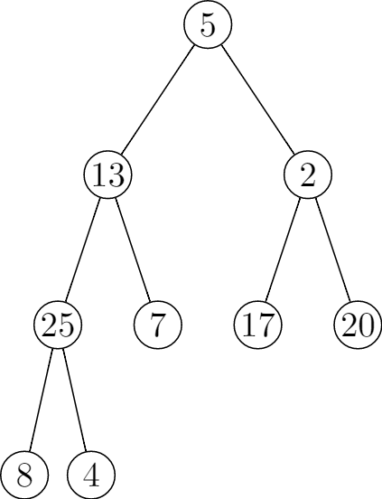
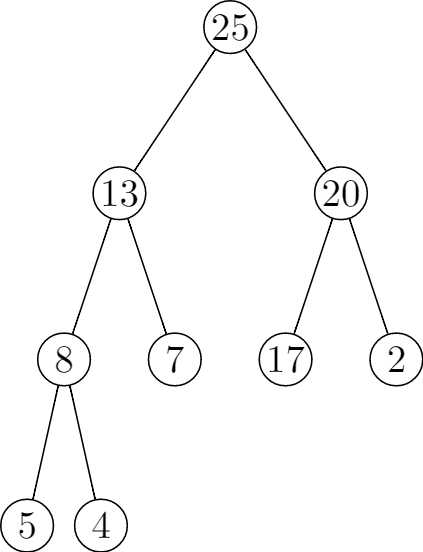
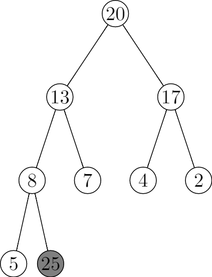
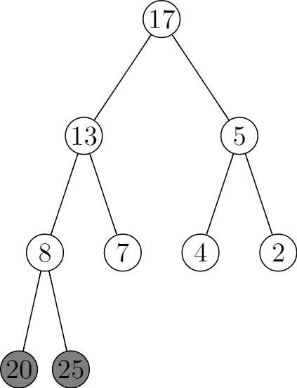
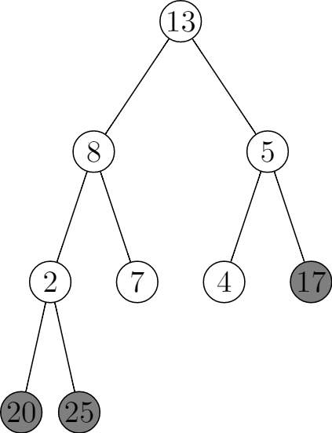
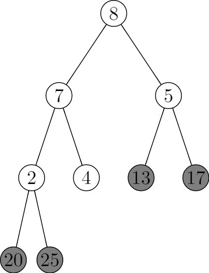
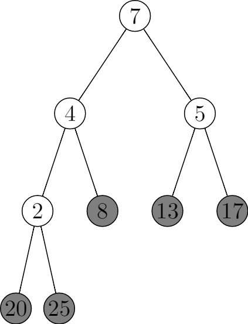
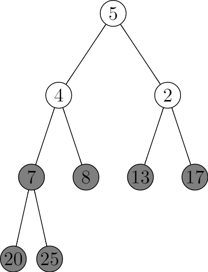
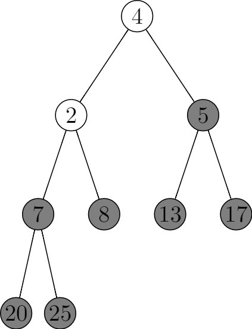
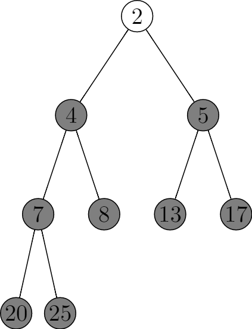

# 6.4 The heapsort algorithm
## 6.4-1

## 6.4-2
**Initialization**: Prior to the first iteration of the loop, i = n, and we called `BUILD-MAX-HEAP` on A, thus the subarray `A[1..n]` is a max-heap containing the n smallest elements of `A[1..n]`, and the subarray `A[n + 1..n]` is an empty array, thus it contains n - n = 0 largest elements of `A[1..n]`, sorted.

**Maintenance**: Let's assume prior to the ith iteration of the loop, the subarray `A[1..i]` is a max-heap containing the i smallest elements of `A[1..n]`, and the subarray `A[i + 1,..n]` contains the n - i largest elements of `A[1..n]`, sorted.

In the ith loop, `A[1]` is the biggest number in the subarray `A[1..i]`, in line 3, it exchanges `A[1]` and `A[i]`, making the subarray `A[i..n]` contains the n - i + 1 largest elements of `A[1..n]`, sorted. In line 4-5, it calls `MAX-HEAPIFY` on A, so it makes the subarray `A[1..i - 1]` to a max-heap contains the i - 1 smallest elements of `A[1..n]`.

**Termination**: At termination, i = 1. By the loop invariant, the subarray `A[1..1]` is a max-heap containing the 1 smallest elements of `A[1..n]`. And the subarray `A[2..n]` contains the n - 1 largest elements of `A[1..n]`, sorted. So the array `A[1..n]` is sorted.

## 6.4-3
If the array is in increasing order, then `BUILD-MAX-HEAP` takes O(n), and it changes A to a max-heap. Then it calls `MAX-HEAPIFY(A, 1)` n - 1 times, at each iteration, there are i - 1 elements in the current max-heap, so the running time of for loop is $\sum_{i = n - 1}^{1}\lg{i} = \lg{((n - 1)!)} = \Theta(n\lg{n})$ (exercise 3.2-3). So the total running time is $O(n) + \Theta(n\lg{n}) = \Theta(n\lg{n})$.

If the array is in decreasing order, it takes O(n) to call `BUILD-MAX-HEAP`, but it won't change the array. But it still needs $\Theta(n\lg{n})$ running time to call `MAX-HEAPIFY(A, 1)`. The total running time is also $\Theta(n\lg{n})$.

## 6.4-4
The worst-case happens when we need to call `MAX-HEAPIFY(A, 1)` in each iteration with the cost $\lg{(i - 1)}$. And the answer is given in the above question.

## 6.4-5
You can find the answer [here](https://www.cs.princeton.edu/research/techreps/TR-293-90).