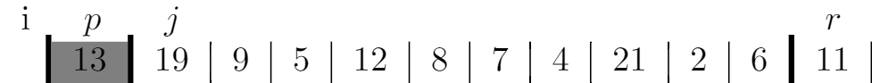
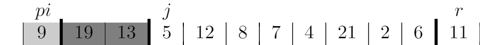
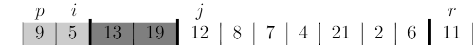
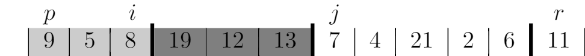
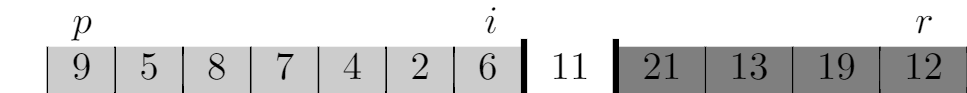

# 7.1 Description of quicksort
## 7.1-1















## 7.1-2
When all elements in the array `A[p..r]` have the same value, it returns `r`.

```
PARTITION(A, p, r)
x = A[r]
i = p - 1
same_value_count = 0
for j = p to r - 1
    if A[j] <= x
        if A[j] == x
            same_value_count = same_value_count + 1
        i = i + 1
        exchange A[i] with A[j]
exchange A[i + 1] with A[r]
if same_value_count = r - p
    return Math.floor((p + 2) / 2)
else
    return i + 1
```

## 7.1-3
The `PARTITION` takes $\Theta(r - p)$ because it iterates the array from j to p. So the `PARTITION` on a subarray of size n is $\Theta(n)$.

## 7.1-4
```
QUICKSORT(A, p, r)
if p < r
    q = PARTITION(A, p, r)
    QUICKSORT(A, p, q - 1)
    QUICKSORT(A, q + 1, r)

PARTITION(A, p, r)
x = A[r]
i = p - 1
for j = p to r - 1
    if A[j] >= x
        i = i + 1
        exchange A[i] with A[j]
exchange A[i + 1] with A[r]
return i + 1
```