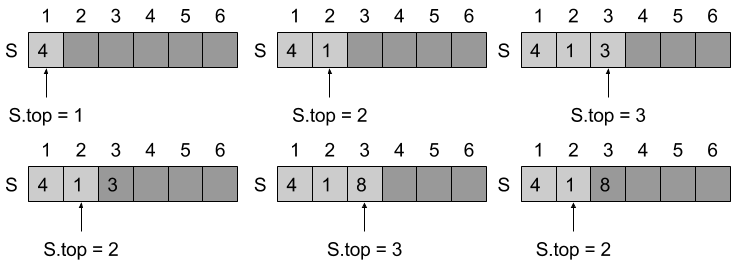
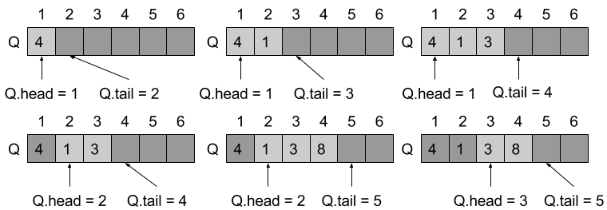

# 10.1 Stacks and queues
## 10.1-1


## 10.1-2
The first stack `S1` starts at the first index, when pushing element into `S1`, we let `S1.top += 1`, and the second stack `S2` starts at the last index, when pushing element into `S2`, we let `S2.top -= 1`, when `S1.top > S2.top`, it overflows.

## 10.1-3


## 10.1-4
Initially, we let `Q.head = 0` and `Q.tail = 1`.

```
ENQUEUE(Q, x)

if Q.head == Q.tail
    error "overflow"
Q[Q.tail] = x
if Q.tail == Q.length
    Q.tail = 1
else
    Q.tail = Q.tail + 1
if Q.head == 0
    Q.head = 1
```

```
DEQUEUE(Q)

if Q.head == 0
    error "underflow"
x = Q[Q.head]
if Q.head = Q.length
    Q.head = 1
else Q.head = Q.head + 1
if Q.head == Q.tail
    Q.head = 0
    Q.tail = 1
return x
```

## 10.1-5
