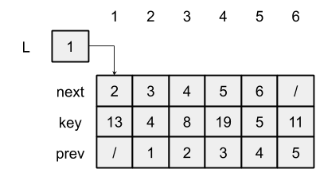
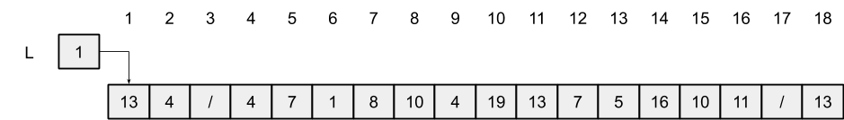

# 10.3 Implementing pointers and objects
## 10.3-1
Multiple-array representation:



Single-array representation:



## 10.3-2
```py
class SingleArrayObjects(object):
    def __init__(self, n):
        assert n >= 3

        self.capacity = n // 3 * 3
        self.list = [None] * self.capacity
        self.free = 0

        for i in range(0, self.capacity, 3):
            self.list[i] = i
            self.list[i + 1] = i + 3 if i + 3 <= self.capacity - 1 else None
            self.list[i + 2] = i - 3 if i >= 3 else None

    def allocate_object(self):
        if self.free is None:
            raise Exception('out of space')

        x = self.free
        self.free = self.list[x + 1]

        return x

    def free_object(self, x):
        self.free = x
```

## 10.3-3
