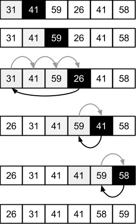

# Insertion sort
## 2.1-1


## 2.1-2
```
INSERTION-SORT (A) (Decreasing order)

for j = 2 to A.length
    key = A[j]
    // Insert A[j] into the sorted sequence A[1..j - 1]
    i = j - 1
    while i > 0 and A[i] < key
        A[i + 1] = A[i]
        i = i - 1
    A[i + 1] = key
```

## 2.1-3
Pseudocode:

```
LINEAR-SEARCH (A)

for i = 1 to A.length
    if A[i] == v
        return i

return NIL
```

Loop invariant:

**At the start of each iteration of the for loop, v doesn't exist in the subarray A[1..i - 1]**.

And let's see how the loop invariant fulfills the three necessary properties.

**Initialization**: in the first loop iteration, i = 1, the subarray A[1..i - 1] is an empty array, therefore, v doesn't exist
int A[1..i - 1]. So it shows that the loop invariant holds prior to the first iteration of the loop.

**Maintenance**: at the start of each iteration of the for loop, we suppose it is true that v doesn't exist in the subarray A[1..i - 1]. Then we check if `A[i] == v`, if it is true, then we are done, we found v. If it is not true, then it means v doesn't exist in the subarray A[1..i], which holds the loop invariant before the `i + 1` iteration.

**Termination**: when the for loop is terminated, i might be some number between 1 and A.length, or i equals to `A.length + 1`. If i equals to `A.length + 1`, we have that the subarray A[1..A.length] doesn't contain v, and since the subarray A[1..A.length] is the entire array, we know v doesn't exist in the entir array, the algorithm is correct. And if i is some number between 1 and A.length, then we know v is found during the for loop, the algorithm is also correct.
