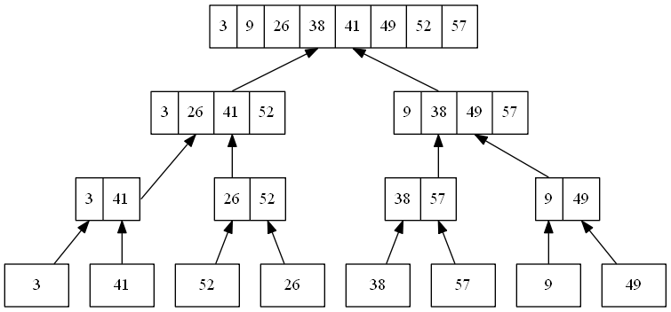

# 2.3 Designing algorithms
## 2.3-1


## 2.3-2
```
MERGE(A, p, q, r)

n1 = q - p + 1
n2 = r - q
let L[1..n1] and R[1..n2] be new arrays
for i = 1 to n1
    L[i] = A[p + i - 1]
for j = 1 to n2
    R[j] = A[q + j]
i = 1
j = 1
for k = p to r
    if i <= n1 and j <= n2
        if L[i] <= R[j]
            A[k] = L[i]
            i = i + 1
        else
            A[k] = R[j]
            j = j + 1
    else if i <= n1
        A[k] = L[i]
        i = i + 1
    else if j <= n2
        A[k] = R[j]
        j = j + 1
```
