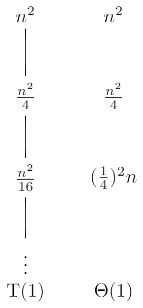
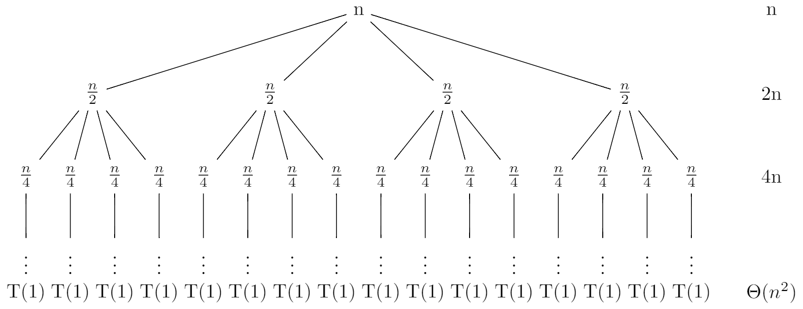
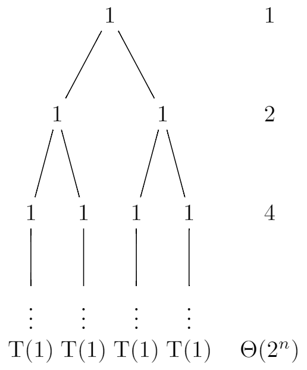

# 4.4 The recursion-tree method for solving recurrences
## 4.4-1
First let's create a recursion tree for the recurrence $T(n) = 3T(\frac{n}{2}) + n$ and assume that n is an exact power of 2.

```
\documentclass{standalone} 
\usepackage{tikz}
\usetikzlibrary{positioning}

\tikzset{
    no edge from this parent/.style={
        every child/.append style={
        edge from parent/.style={draw=none}}},
    level 4/.style={level distance=6mm} 
}

\begin{document}
\begin{tikzpicture}
\tikzstyle{level 1}=[sibling distance=24mm]
\tikzstyle{level 2}=[sibling distance=8mm]
\tikzstyle{level 3}=[sibling distance=4mm]

\node (root){n} 
    child {node {$\frac{n}{2}$}
        child {node {$\frac{n}{4}$}
            child{node {$\vdots$}[no edge from this parent]
                child{node {T(1)}}}}
        child {node {$\frac{n}{4}$}
            child{node {$\vdots$}[no edge from this parent]
                child{node {T(1)}}}}
        child {node {$\frac{n}{4}$}
            child{node {$\vdots$}[no edge from this parent]
                child{node {T(1)}}}}}
    child {node {$\frac{n}{2}$}
        child {node {$\frac{n}{4}$}
            child{node {$\vdots$}[no edge from this parent]
                child{node {T(1)}}}}
        child {node {$\frac{n}{4}$}
            child{node {$\vdots$}[no edge from this parent]
                child{node {T(1)}}}}
        child {node {$\frac{n}{4}$}
            child{node {$\vdots$}[no edge from this parent]
                child{node {T(1)}}}}}
    child {node {$\frac{n}{2}$}
        child {node {$\frac{n}{4}$}
            child{node {$\vdots$}[no edge from this parent]
                child{node {T(1)}}}}
        child {node {$\frac{n}{4}$}
            child{node {$\vdots$}[no edge from this parent]
                child{node {T(1)}}}}
        child {node {$\frac{n}{4}$}
            child{node {$\vdots$}[no edge from this parent]
                child{node {T(1)}}}}};

\node[right=4 of root] {n}[no edge from this parent]
    child {node {$\frac{3n}{2}$}[no edge from this parent]
        child {node {$(\frac{3}{2})^2n$}[no edge from this parent]
            child {node {}[no edge from this parent]
                child {node {$\Theta(n^{\lg{3}})$}}}}};
\end{tikzpicture}
\end{document}
```


Each level has three times more nodes than the level above, so the number of nodes at depth i is $3^i$. And each node at depth i, for $i = 0, 1, 2, \ldots, \lg{n} - 1$, has a cost of $\frac{n}{2^i}$. So the total cost over all nodes at depth i, is $3^i\frac{n}{2^i} = (\frac{3}{2})^in$. The bottom level, at depth $\lg{n}$, has $3^{\lg{n}} = n^{\lg{3}}$ nodes, each contributing cost $T(1)$, for a total cost of $n^{\lg{3}}T(1)$, which is $\Theta(n^{\lg{3}})$. So:

$$
\begin{eqnarray}
T(n) &=& \sum_{i = 0}^{\lg{n} - 1}(\frac{3}{2})^in + \Theta(n^{\lg{3}}) \\\
&=& n\frac{1 - (\frac{3}{2})^{\lg{n}}}{1 - \frac{3}{2}} + \Theta(n^{\lg3}) \\\
&=& 2n\frac{3^{\lg{n}} - 2^{\lg{n}}}{2^{\lg{n}}} + \Theta(n^{\lg3}) \\\
&=& 2n\frac{3^{\lg{n}} - 2^{\lg{n}}}{n} + \Theta(n^{\lg3}) \\\
&=& 2(3^{\lg{n}} - 2^{\lg{n}}) + \Theta(n^{\lg3}) \\\
&=& 2(n^{\lg{3}} -n) + \Theta(n^{\lg3}) \\\
&<& 2n^{\lg3} + \Theta(n^{\lg3}) \\\
&=& O(n^{\lg3})
\end{eqnarray}
$$

Thus, we have derived a guess of $T(n) = O(n^{\lg3})$ for our original recurrence. Now let's use the substitution method to verify that our guess was correct. We want to show that $T(n) \leq cn^{\lg3}$ for some constant $c > 0$. So:

$$
\begin{eqnarray}
T(n) &=& 3T(\lfloor \frac{n}{2} \rfloor) + n \\\
&\leq& 3c\lfloor \frac{n}{2} \rfloor^{\lg3} + n \\\
&\leq& 3c(\frac{n}{2})^{\lg3} + n \\\
&=& 3c(\frac{n}{2})^{\lg3} + n \\\
&=& 3c\frac{n^{\lg3}}{2^{\lg3}} + n \\\
&=& 3c\frac{n^{\lg3}}{3} + n \\\
&=& cn^{\lg{3}} + n
\end{eqnarray}
$$

But $cn^{\lg{3}} + n > cn^{\lg{3}}$, so we need to try another guess. Let's try $T(n) \leq cn^{\lg3} - \frac{2n}{3}$. So:

$$
\begin{eqnarray}
T(n) &=& 3T(\lfloor \frac{n}{2} \rfloor) + n \\\
&\leq& 3(c\lfloor \frac{n}{2} \rfloor^{\lg3} - \frac{n}{3}) + n \\\
&\leq& 3(c(\frac{n}{2})^{\lg3} - \frac{n}{3}) + n \\\
&=& 3c(\frac{n}{2})^{\lg3} \\\
&=& cn^{\lg3}
\end{eqnarray}
$$

## 4.4-2
First let's create a recursion tree for the recurrence $T(n) = T(\frac{n}{2}) + n^2$ and assume that n is an exact power of 2.

```
\documentclass{standalone} 
\usepackage{tikz}
\usetikzlibrary{positioning}

\tikzset{
    no edge from this parent/.style={
        every child/.append style={
        edge from parent/.style={draw=none}}},
    level 4/.style={level distance=6mm} 
}

\begin{document}
\begin{tikzpicture}

\node (root){$n^2$} 
    child {node {$\frac{n^2}{4}$}
        child {node {$\frac{n^2}{16}$}
            child{node {$\vdots$}[no edge from this parent]
                child{node {T(1)}}}}};

\node[right=1 of root] {$n^2$}[no edge from this parent]
    child {node {$\frac{n^2}{4}$}[no edge from this parent]
        child {node {$(\frac{1}{4})^2n$}[no edge from this parent]
            child {node {}[no edge from this parent]
                child {node {$\Theta(1)$}}}}};
\end{tikzpicture}
\end{document}
```



The number of nodes at depth i is 1. And each node at depth i, for $i = 0, 1, 2, \ldots, \lg{n} - 1$, has a cost of $\frac{n^2}{4^i}$. So the total cost over all nodes at depth i, is $\frac{n^2}{4^i}$. The bottom level, at depth $\lg{n}$, has 1 node, which contributing cost $T(1)$, for a total cost of $T(1)$, which is $\Theta(1)$. So:

$$
\begin{eqnarray}
T(n) &=& \sum_{i = 0}^{\lg{n} - 1}\frac{n^2}{4^i} + \Theta(1) \\\
&<& \sum_{i = 0}^{\infty}\frac{n^2}{4^i} + \Theta(1) \\\
&=& \frac{1}{1 - \frac{1}{4}}n^2 + \Theta(1) \\\
&=& \frac{4}{3}n^2 + \Theta(1) \\\
&=& O(n^2)
\end{eqnarray}
$$

Thus, we have derived a guess of $T(n) = O(n^2)$ for our original recurrence. Now let's use the substitution method to verify that our guess was correct. We want to show that $T(n) \leq cn^2$ for some constant $c > 0$. So:

$$
\begin{eqnarray}
T(n) &=& T(\frac{n}{2}) + n^2 \\\
&\leq& c(\frac{n}{2})^2 + n^2 \\\
&=& (\frac{c}{4} + 1)n^2 \\\
&\leq& cn^2
\end{eqnarray}
$$

where the last step holds as long as $c \geq \frac{4}{3}$.

## 4.4-3
When n is large, the difference between $\frac{n}{2} + 2$ and $\frac{n}{2}$ not that large, so it's also a sloppiness that we can tolerate. Then let's create a recursion tree for the recurrence $T(n) = T(\frac{n}{2}) + n$ and assume that n is an exact power of 2.

```
\documentclass{standalone} 
\usepackage{tikz}
\usetikzlibrary{positioning}

\tikzset{
    no edge from this parent/.style={
        every child/.append style={
        edge from parent/.style={draw=none}}},
    level 4/.style={level distance=6mm} 
}

\begin{document}
\begin{tikzpicture}
\tikzstyle{level 1}=[sibling distance=32mm]
\tikzstyle{level 2}=[sibling distance=8mm]
\tikzstyle{level 3}=[sibling distance=4mm]

\node (root){n} 
    child {node {$\frac{n}{2}$}
        child {node {$\frac{n}{4}$}
            child{node {$\vdots$}[no edge from this parent]
                child{node {T(1)}}}}
        child {node {$\frac{n}{4}$}
            child{node {$\vdots$}[no edge from this parent]
                child{node {T(1)}}}}
        child {node {$\frac{n}{4}$}
            child{node {$\vdots$}[no edge from this parent]
                child{node {T(1)}}}}
        child {node {$\frac{n}{4}$}
            child{node {$\vdots$}[no edge from this parent]
                child{node {T(1)}}}}}
    child {node {$\frac{n}{2}$}
        child {node {$\frac{n}{4}$}
            child{node {$\vdots$}[no edge from this parent]
                child{node {T(1)}}}}
        child {node {$\frac{n}{4}$}
            child{node {$\vdots$}[no edge from this parent]
                child{node {T(1)}}}}
        child {node {$\frac{n}{4}$}
            child{node {$\vdots$}[no edge from this parent]
                child{node {T(1)}}}}
        child {node {$\frac{n}{4}$}
            child{node {$\vdots$}[no edge from this parent]
                child{node {T(1)}}}}}
    child {node {$\frac{n}{2}$}
        child {node {$\frac{n}{4}$}
            child{node {$\vdots$}[no edge from this parent]
                child{node {T(1)}}}}
        child {node {$\frac{n}{4}$}
            child{node {$\vdots$}[no edge from this parent]
                child{node {T(1)}}}}
        child {node {$\frac{n}{4}$}
            child{node {$\vdots$}[no edge from this parent]
                child{node {T(1)}}}}
        child {node {$\frac{n}{4}$}
            child{node {$\vdots$}[no edge from this parent]
                child{node {T(1)}}}}}
    child {node {$\frac{n}{2}$}
        child {node {$\frac{n}{4}$}
            child{node {$\vdots$}[no edge from this parent]
                child{node {T(1)}}}}
        child {node {$\frac{n}{4}$}
            child{node {$\vdots$}[no edge from this parent]
                child{node {T(1)}}}}
        child {node {$\frac{n}{4}$}
            child{node {$\vdots$}[no edge from this parent]
                child{node {T(1)}}}}
        child {node {$\frac{n}{4}$}
            child{node {$\vdots$}[no edge from this parent]
                child{node {T(1)}}}}};

\node[right=7 of root] {n}[no edge from this parent]
    child {node {2n}[no edge from this parent]
        child {node {4n}[no edge from this parent]
            child {node {}[no edge from this parent]
                child {node {$\Theta(n^2)$}}}}};
\end{tikzpicture}
\end{document}
```


Each level has four times more nodes than the level above, so the number of nodes at depth i is $4^i$. And each node at depth i, for $i = 0, 1, 2, \ldots, \lg{n} - 1$, has a cost of $\frac{n}{2^i}$. So the total cost over all nodes at depth i, is $4^i\frac{n}{2^i} = 2^in$. The bottom level, at depth $\lg{n}$, has $4^{\lg{n}} = n^2$ nodes, each contributing cost $T(1)$, for a total cost of $n^2T(1)$, which is $\Theta(n^2)$. So:

$$
\begin{eqnarray}
T(n) &=& \sum_{i = 0}^{\lg{n} - 1}2^in + \Theta(n^2) \\\
&=& n\frac{1 - 2^{\lg{n}}}{1 - 2} + \Theta(n^2) \\\
&=& n(n - 1) + \Theta(n^2) \\\
&=& n^2 - n + \Theta(n^2) \\\
&=& O(n^2)
\end{eqnarray}
$$

Thus, we have derived a guess of $T(n) = O(n^2)$ for our original recurrence. Now let's use the substitution method to verify that our guess was correct. We want to show that $T(n) \leq cn^2$ for some constant $c > 0$. So:

$$
\begin{eqnarray}
T(n) &=& 4T(\frac{n}{2} + 2) + n \\\
&\leq& 4c(\frac{n}{2} + 2)^2 + n \\\
&=& 4c(\frac{n^2}{4} + 2n + 4) + n \\\
&=& cn^2 + 8cn + 16c + n \\\
&=& cn^2 + (8c + 1)n + 16c
\end{eqnarray}
$$

But $cn^2 + (8c + 1)n + 16c > cn^2$, so we need to try another guess, let's try $T(n) \leq cn^2 - 5n$. So:

$$
\begin{eqnarray}
T(n) &=& 4T(\frac{n}{2} + 2) + n \\\
&\leq& 4c((\frac{n}{2} + 2)^2 - 5(\frac{n}{2} + 2)) + n \\\
&=& 4c(\frac{n^2}{4} + 2n + 4 - \frac{5n}{2} - 10) + n \\\
&=& 4c(\frac{n^2}{4} - \frac{n}{2} - 6) + n \\\
&=& cn^2 + (1 - 2c)n - 24c \\\
&<& cn^2
\end{eqnarray}
$$

where the last step holds as long as $c \geq \frac{1}{2}$.

## 4.4-4
First let's create a recursion tree for the recurrence $T(n) = 2T(n - 1) + 1$.

```
\documentclass{standalone} 
\usepackage{tikz}
\usetikzlibrary{positioning}

\tikzset{
    no edge from this parent/.style={
        every child/.append style={
        edge from parent/.style={draw=none}}},
    level 4/.style={level distance=6mm} 
}

\begin{document}
\begin{tikzpicture}
\tikzstyle{level 1}=[sibling distance=16mm]
\tikzstyle{level 2}=[sibling distance=8mm]
\tikzstyle{level 3}=[sibling distance=4mm]

\node (root){1} 
    child {node {1}
        child {node {1}
            child{node {$\vdots$}[no edge from this parent]
                child{node {T(1)}}}}
        child {node {1}
            child{node {$\vdots$}[no edge from this parent]
                child{node {T(1)}}}}}
    child {node {1}
        child {node {1}
            child{node {$\vdots$}[no edge from this parent]
                child{node {T(1)}}}}
        child {node {1}
            child{node {$\vdots$}[no edge from this parent]
                child{node {T(1)}}}}};

\node[right=2 of root] {1}[no edge from this parent]
    child {node {2}[no edge from this parent]
        child {node {4}[no edge from this parent]
            child {node {}[no edge from this parent]
                child {node {$\Theta(2^n)$}}}}};
\end{tikzpicture}
\end{document}
```



Each level has two times more nodes than the level above, so the number of nodes at depth i is $2^i$. And each node at depth i, for $i = 0, 1, 2, \ldots, n - 1 - 1$, has a cost of 1. So the total cost over all nodes at depth i, is $2^i$. The bottom level, at depth n, has $2^{n - 1}$ nodes, each contributing cost $T(1)$, for a total cost of $2^{n - 1}T(1)$, which is $\Theta(2^n)$. So:

$$
\begin{eqnarray}
T(n) &=& \sum_{i = 0}^{n - 1 - 1}2^i + \Theta(2^n) \\\
&=& \frac{1 - 2^{n - 1}}{1 - 2} + \Theta(2^n) \\\
&=& 2^{n - 1} - 1 + \Theta(2^n) \\\
&=& O(2^n)
\end{eqnarray}
$$

Thus, we have derived a guess of $T(n) = O(2^n)$ for our original recurrence. Now let's use the substitution method to verify that our guess was correct. We want to show that $T(n) \leq c2^n$ for some constant $c > 0$. So:

$$
\begin{eqnarray}
T(n) &=& 2T(n - 1) + 1 \\\
&\leq& 2c2^{n - 1} + 1 \\\
&=& c2^n + 1
\end{eqnarray}
$$

But $c2^n + 1 > c2^n$, so we need to try another guess. Lets try $T(n) \leq c2^n - 1$. So:

$$
\begin{eqnarray}
T(n) &=& 2T(n - 1) + 1 \\\
&\leq& 2(c2^{n - 1} - 1) + 1 \\\
&=& c2^n -1 \\\
&<& c2^n
\end{eqnarray}
$$

## 4.4-5