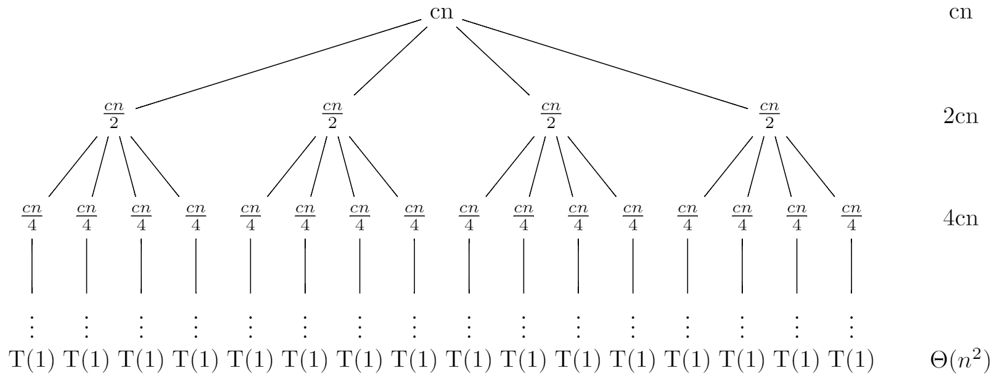

# 4.4 The recursion-tree method for solving recurrences
## 4.4-1
First let's create a recursion tree for the recurrence $T(n) = 3T(\frac{n}{2}) + n$ and assume that n is an exact power of 2.

```
\documentclass{standalone}
\usepackage{tikz}
\usetikzlibrary{positioning}

\tikzset{
    no edge from this parent/.style={
        every child/.append style={
        edge from parent/.style={draw=none}}},
    level 4/.style={level distance=6mm}
}

\begin{document}
\begin{tikzpicture}
\tikzstyle{level 1}=[sibling distance=24mm]
\tikzstyle{level 2}=[sibling distance=8mm]
\tikzstyle{level 3}=[sibling distance=4mm]

\node (root){n}
    child {node {$\frac{n}{2}$}
        child {node {$\frac{n}{4}$}
            child {node {$\vdots$}[no edge from this parent]
                child {node {T(1)}}}}
        child {node {$\frac{n}{4}$}
            child {node {$\vdots$}[no edge from this parent]
                child {node {T(1)}}}}
        child {node {$\frac{n}{4}$}
            child {node {$\vdots$}[no edge from this parent]
                child {node {T(1)}}}}}
    child {node {$\frac{n}{2}$}
        child {node {$\frac{n}{4}$}
            child {node {$\vdots$}[no edge from this parent]
                child {node {T(1)}}}}
        child {node {$\frac{n}{4}$}
            child {node {$\vdots$}[no edge from this parent]
                child {node {T(1)}}}}
        child {node {$\frac{n}{4}$}
            child {node {$\vdots$}[no edge from this parent]
                child {node {T(1)}}}}}
    child {node {$\frac{n}{2}$}
        child {node {$\frac{n}{4}$}
            child {node {$\vdots$}[no edge from this parent]
                child {node {T(1)}}}}
        child {node {$\frac{n}{4}$}
            child {node {$\vdots$}[no edge from this parent]
                child {node {T(1)}}}}
        child {node {$\frac{n}{4}$}
            child {node {$\vdots$}[no edge from this parent]
                child {node {T(1)}}}}};

\node[right=4 of root] {n}[no edge from this parent]
    child {node {$\frac{3n}{2}$}[no edge from this parent]
        child {node {$(\frac{3}{2})^2n$}[no edge from this parent]
            child {node {}[no edge from this parent]
                child {node {$\Theta(n^{\lg{3}})$}}}}};
\end{tikzpicture}
\end{document}
```


Each level has three times more nodes than the level above, so the number of nodes at depth i is $3^i$. And each node at depth i, for $i = 0, 1, 2, \ldots, \lg{n} - 1$, has a cost of $\frac{n}{2^i}$. So the total cost over all nodes at depth i, is $3^i\frac{n}{2^i} = (\frac{3}{2})^in$. The bottom level, at depth $\lg{n}$, has $3^{\lg{n}} = n^{\lg{3}}$ nodes, each contributing cost $T(1)$, for a total cost of $n^{\lg{3}}T(1)$, which is $\Theta(n^{\lg{3}})$. So:

$$
\begin{eqnarray}
T(n) &=& \sum_{i = 0}^{\lg{n} - 1}(\frac{3}{2})^in + \Theta(n^{\lg{3}}) \\\
&=& n\frac{1 - (\frac{3}{2})^{\lg{n}}}{1 - \frac{3}{2}} + \Theta(n^{\lg3}) \\\
&=& 2n\frac{3^{\lg{n}} - 2^{\lg{n}}}{2^{\lg{n}}} + \Theta(n^{\lg3}) \\\
&=& 2n\frac{3^{\lg{n}} - 2^{\lg{n}}}{n} + \Theta(n^{\lg3}) \\\
&=& 2(3^{\lg{n}} - 2^{\lg{n}}) + \Theta(n^{\lg3}) \\\
&=& 2(n^{\lg{3}} -n) + \Theta(n^{\lg3}) \\\
&<& 2n^{\lg3} + \Theta(n^{\lg3}) \\\
&=& O(n^{\lg3})
\end{eqnarray}
$$

Thus, we have derived a guess of $T(n) = O(n^{\lg3})$ for our original recurrence. Now let's use the substitution method to verify that our guess was correct. We want to show that $T(n) \leq cn^{\lg3}$ for some constant $c > 0$. So:

$$
\begin{eqnarray}
T(n) &=& 3T(\lfloor \frac{n}{2} \rfloor) + n \\\
&\leq& 3c\lfloor \frac{n}{2} \rfloor^{\lg3} + n \\\
&\leq& 3c(\frac{n}{2})^{\lg3} + n \\\
&=& 3c(\frac{n}{2})^{\lg3} + n \\\
&=& 3c\frac{n^{\lg3}}{2^{\lg3}} + n \\\
&=& 3c\frac{n^{\lg3}}{3} + n \\\
&=& cn^{\lg{3}} + n
\end{eqnarray}
$$

But $cn^{\lg{3}} + n > cn^{\lg{3}}$, so we need to try another guess. Let's try $T(n) \leq cn^{\lg3} - \frac{2n}{3}$. So:

$$
\begin{eqnarray}
T(n) &=& 3T(\lfloor \frac{n}{2} \rfloor) + n \\\
&\leq& 3(c\lfloor \frac{n}{2} \rfloor^{\lg3} - \frac{n}{3}) + n \\\
&\leq& 3(c(\frac{n}{2})^{\lg3} - \frac{n}{3}) + n \\\
&=& 3c(\frac{n}{2})^{\lg3} \\\
&=& cn^{\lg3}
\end{eqnarray}
$$

## 4.4-2
First let's create a recursion tree for the recurrence $T(n) = T(\frac{n}{2}) + n^2$ and assume that n is an exact power of 2.

```
\documentclass{standalone}
\usepackage{tikz}
\usetikzlibrary{positioning}

\tikzset{
    no edge from this parent/.style={
        every child/.append style={
        edge from parent/.style={draw=none}}},
    level 4/.style={level distance=6mm}
}

\begin{document}
\begin{tikzpicture}

\node (root){$n^2$}
    child {node {$\frac{n^2}{4}$}
        child {node {$\frac{n^2}{16}$}
            child {node {$\vdots$}[no edge from this parent]
                child {node {T(1)}}}}};

\node[right=1 of root] {$n^2$}[no edge from this parent]
    child {node {$\frac{n^2}{4}$}[no edge from this parent]
        child {node {$(\frac{1}{4})^2n$}[no edge from this parent]
            child {node {}[no edge from this parent]
                child {node {$\Theta(1)$}}}}};
\end{tikzpicture}
\end{document}
```


The number of nodes at depth i is 1. And each node at depth i, for $i = 0, 1, 2, \ldots, \lg{n} - 1$, has a cost of $\frac{n^2}{4^i}$. So the total cost over all nodes at depth i, is $\frac{n^2}{4^i}$. The bottom level, at depth $\lg{n}$, has 1 node, which contributing cost $T(1)$, for a total cost of $T(1)$, which is $\Theta(1)$. So:

$$
\begin{eqnarray}
T(n) &=& \sum_{i = 0}^{\lg{n} - 1}\frac{n^2}{4^i} + \Theta(1) \\\
&<& \sum_{i = 0}^{\infty}\frac{n^2}{4^i} + \Theta(1) \\\
&=& \frac{1}{1 - \frac{1}{4}}n^2 + \Theta(1) \\\
&=& \frac{4}{3}n^2 + \Theta(1) \\\
&=& O(n^2)
\end{eqnarray}
$$

Thus, we have derived a guess of $T(n) = O(n^2)$ for our original recurrence. Now let's use the substitution method to verify that our guess was correct. We want to show that $T(n) \leq cn^2$ for some constant $c > 0$. So:

$$
\begin{eqnarray}
T(n) &=& T(\frac{n}{2}) + n^2 \\\
&\leq& c(\frac{n}{2})^2 + n^2 \\\
&=& (\frac{c}{4} + 1)n^2 \\\
&\leq& cn^2
\end{eqnarray}
$$

where the last step holds as long as $c \geq \frac{4}{3}$.

## 4.4-3
When n is large, the difference between $\frac{n}{2} + 2$ and $\frac{n}{2}$ not that large, so it's also a sloppiness that we can tolerate. Then let's create a recursion tree for the recurrence $T(n) = 4T(\frac{n}{2}) + n$ and assume that n is an exact power of 2.

```
\documentclass{standalone}
\usepackage{tikz}
\usetikzlibrary{positioning}

\tikzset{
    no edge from this parent/.style={
        every child/.append style={
        edge from parent/.style={draw=none}}},
    level 4/.style={level distance=6mm}
}

\begin{document}
\begin{tikzpicture}
\tikzstyle{level 1}=[sibling distance=32mm]
\tikzstyle{level 2}=[sibling distance=8mm]
\tikzstyle{level 3}=[sibling distance=4mm]

\node (root){n}
    child {node {$\frac{n}{2}$}
        child {node {$\frac{n}{4}$}
            child {node {$\vdots$}[no edge from this parent]
                child {node {T(1)}}}}
        child {node {$\frac{n}{4}$}
            child {node {$\vdots$}[no edge from this parent]
                child {node {T(1)}}}}
        child {node {$\frac{n}{4}$}
            child {node {$\vdots$}[no edge from this parent]
                child {node {T(1)}}}}
        child {node {$\frac{n}{4}$}
            child {node {$\vdots$}[no edge from this parent]
                child {node {T(1)}}}}}
    child {node {$\frac{n}{2}$}
        child {node {$\frac{n}{4}$}
            child {node {$\vdots$}[no edge from this parent]
                child {node {T(1)}}}}
        child {node {$\frac{n}{4}$}
            child {node {$\vdots$}[no edge from this parent]
                child {node {T(1)}}}}
        child {node {$\frac{n}{4}$}
            child {node {$\vdots$}[no edge from this parent]
                child {node {T(1)}}}}
        child {node {$\frac{n}{4}$}
            child {node {$\vdots$}[no edge from this parent]
                child {node {T(1)}}}}}
    child {node {$\frac{n}{2}$}
        child {node {$\frac{n}{4}$}
            child {node {$\vdots$}[no edge from this parent]
                child {node {T(1)}}}}
        child {node {$\frac{n}{4}$}
            child {node {$\vdots$}[no edge from this parent]
                child {node {T(1)}}}}
        child {node {$\frac{n}{4}$}
            child {node {$\vdots$}[no edge from this parent]
                child {node {T(1)}}}}
        child {node {$\frac{n}{4}$}
            child {node {$\vdots$}[no edge from this parent]
                child {node {T(1)}}}}}
    child {node {$\frac{n}{2}$}
        child {node {$\frac{n}{4}$}
            child {node {$\vdots$}[no edge from this parent]
                child {node {T(1)}}}}
        child {node {$\frac{n}{4}$}
            child {node {$\vdots$}[no edge from this parent]
                child {node {T(1)}}}}
        child {node {$\frac{n}{4}$}
            child {node {$\vdots$}[no edge from this parent]
                child {node {T(1)}}}}
        child {node {$\frac{n}{4}$}
            child {node {$\vdots$}[no edge from this parent]
                child {node {T(1)}}}}};

\node[right=7 of root] {n}[no edge from this parent]
    child {node {2n}[no edge from this parent]
        child {node {4n}[no edge from this parent]
            child {node {}[no edge from this parent]
                child {node {$\Theta(n^2)$}}}}};
\end{tikzpicture}
\end{document}
```


Each level has four times more nodes than the level above, so the number of nodes at depth i is $4^i$. And each node at depth i, for $i = 0, 1, 2, \ldots, \lg{n} - 1$, has a cost of $\frac{n}{2^i}$. So the total cost over all nodes at depth i, is $4^i\frac{n}{2^i} = 2^in$. The bottom level, at depth $\lg{n}$, has $4^{\lg{n}} = n^2$ nodes, each contributing cost $T(1)$, for a total cost of $n^2T(1)$, which is $\Theta(n^2)$. So:

$$
\begin{eqnarray}
T(n) &=& \sum_{i = 0}^{\lg{n} - 1}2^in + \Theta(n^2) \\\
&=& n\frac{1 - 2^{\lg{n}}}{1 - 2} + \Theta(n^2) \\\
&=& n(n - 1) + \Theta(n^2) \\\
&=& n^2 - n + \Theta(n^2) \\\
&=& O(n^2)
\end{eqnarray}
$$

Thus, we have derived a guess of $T(n) = O(n^2)$ for our original recurrence. Now let's use the substitution method to verify that our guess was correct. We want to show that $T(n) \leq cn^2$ for some constant $c > 0$. So:

$$
\begin{eqnarray}
T(n) &=& 4T(\frac{n}{2} + 2) + n \\\
&\leq& 4c(\frac{n}{2} + 2)^2 + n \\\
&=& 4c(\frac{n^2}{4} + 2n + 4) + n \\\
&=& cn^2 + 8cn + 16c + n \\\
&=& cn^2 + (8c + 1)n + 16c
\end{eqnarray}
$$

But $cn^2 + (8c + 1)n + 16c > cn^2$, so we need to try another guess, let's try $T(n) \leq cn^2 - 5n$. So:

$$
\begin{eqnarray}
T(n) &=& 4T(\frac{n}{2} + 2) + n \\\
&\leq& 4c((\frac{n}{2} + 2)^2 - 5(\frac{n}{2} + 2)) + n \\\
&=& 4c(\frac{n^2}{4} + 2n + 4 - \frac{5n}{2} - 10) + n \\\
&=& 4c(\frac{n^2}{4} - \frac{n}{2} - 6) + n \\\
&=& cn^2 + (1 - 2c)n - 24c \\\
&<& cn^2
\end{eqnarray}
$$

where the last step holds as long as $c \geq \frac{1}{2}$.

## 4.4-4
First let's create a recursion tree for the recurrence $T(n) = 2T(n - 1) + 1$.

```
\documentclass{standalone}
\usepackage{tikz}
\usetikzlibrary{positioning}

\tikzset{
    no edge from this parent/.style={
        every child/.append style={
        edge from parent/.style={draw=none}}},
    level 4/.style={level distance=6mm}
}

\begin{document}
\begin{tikzpicture}
\tikzstyle{level 1}=[sibling distance=16mm]
\tikzstyle{level 2}=[sibling distance=8mm]
\tikzstyle{level 3}=[sibling distance=4mm]

\node (root){1}
    child {node {1}
        child {node {1}
            child {node {$\vdots$}[no edge from this parent]
                child {node {T(1)}}}}
        child {node {1}
            child {node {$\vdots$}[no edge from this parent]
                child {node {T(1)}}}}}
    child {node {1}
        child {node {1}
            child {node {$\vdots$}[no edge from this parent]
                child {node {T(1)}}}}
        child {node {1}
            child {node {$\vdots$}[no edge from this parent]
                child {node {T(1)}}}}};

\node[right=2 of root] {1}[no edge from this parent]
    child {node {2}[no edge from this parent]
        child {node {4}[no edge from this parent]
            child {node {}[no edge from this parent]
                child {node {$\Theta(2^n)$}}}}};
\end{tikzpicture}
\end{document}
```


Each level has two times more nodes than the level above, so the number of nodes at depth i is $2^i$. And each node at depth i, for $i = 0, 1, 2, \ldots, n - 1 - 1$, has a cost of 1. So the total cost over all nodes at depth i, is $2^i$. The bottom level, at depth n, has $2^{n - 1}$ nodes, each contributing cost $T(1)$, for a total cost of $2^{n - 1}T(1)$, which is $\Theta(2^n)$. So:

$$
\begin{eqnarray}
T(n) &=& \sum_{i = 0}^{n - 1 - 1}2^i + \Theta(2^n) \\\
&=& \frac{1 - 2^{n - 1}}{1 - 2} + \Theta(2^n) \\\
&=& 2^{n - 1} - 1 + \Theta(2^n) \\\
&=& O(2^n)
\end{eqnarray}
$$

Thus, we have derived a guess of $T(n) = O(2^n)$ for our original recurrence. Now let's use the substitution method to verify that our guess was correct. We want to show that $T(n) \leq c2^n$ for some constant $c > 0$. So:

$$
\begin{eqnarray}
T(n) &=& 2T(n - 1) + 1 \\\
&\leq& 2c2^{n - 1} + 1 \\\
&=& c2^n + 1
\end{eqnarray}
$$

But $c2^n + 1 > c2^n$, so we need to try another guess. Lets try $T(n) \leq c2^n - 1$. So:

$$
\begin{eqnarray}
T(n) &=& 2T(n - 1) + 1 \\\
&\leq& 2(c2^{n - 1} - 1) + 1 \\\
&=& c2^n -1 \\\
&<& c2^n
\end{eqnarray}
$$

## 4.4-5

## 4.4-6
First let's create a recursion tree for the recurrence $T(n) = T(\frac{n}{3}) + T(\frac{2n}{3})$ and assume that n is an exact power of 3.

```
\documentclass{standalone}
\usepackage{tikz}
\usetikzlibrary{positioning}

\tikzset{
    no edge from this parent/.style={
        every child/.append style={
        edge from parent/.style={draw=none}}},
    level 4/.style={level distance=6mm}
}

\begin{document}
\begin{tikzpicture}
\tikzstyle{level 1}=[sibling distance=16mm]
\tikzstyle{level 2}=[sibling distance=8mm]
\tikzstyle{level 3}=[sibling distance=4mm]

\node (root){cn}
    child {node {$c\frac{n}{3}$}
        child {node {$c\frac{n}{9}$}
            child {node {$\vdots$}[no edge from this parent]
                child {node {T(1)}}}}
        child {node {$c\frac{2n}{9}$}
            child {node {$\vdots$}[no edge from this parent]
                child {node {T(1)}}}}}
    child {node {$c\frac{2n}{3}$}
        child {node {$c\frac{2n}{9}$}
            child {node {$\vdots$}[no edge from this parent]
                child {node {T(1)}}}}
        child {node {$c\frac{4n}{9}$}
            child {node {$\vdots$}[no edge from this parent]
                child {node {T(1)}}}}};

\node[right=2 of root] {cn}[no edge from this parent]
    child {node {cn}[no edge from this parent]
        child {node {cn}[no edge from this parent]
            child {node {}[no edge from this parent]
                child {node {$\Theta(?)$}}}}};
\end{tikzpicture}
\end{document}
```


Each level has 2 times more nodes than the level above, so the number of nodes at depth i is $2^i$. But in this question, not all leaves reach at the bottom at the same time. The left most branch reaches the bottom first. So when the left most branch reaches the bottom, we assume other nodes also reach the bottom. Then the depth of recursion tree is $\log_3{n}$.

The total cost over all nodes at depth i, is $cn$ and the cost at bottom is also cn So:

$$
\begin{eqnarray}
T(n) &\geq& \sum_{i = 0}^{\log_3{n} - 1}cn + cn \\\
&=& cn\log_3{n} + cn \\\
&=& \frac{c}{\lg3}n\lg{n} + cn \\\
&=& \Theta(n\lg{n})
\end{eqnarray}
$$

But remember we've cut some branches of the recursion tree, so $T(n) = \Omega(n\lg{n})$.

## 4.4-7
When n is large, the difference between $\frac{n}{2}$ and $\lfloor \frac{n}{2} \rfloor$ not that large, so it's also a sloppiness that we can tolerate. Then let's create a recursion tree for the recurrence $T(n) = 4T(\frac{n}{2}) + cn$ and assume that n is an exact power of 2.

```
\documentclass{standalone}
\usepackage{tikz}
\usetikzlibrary{positioning}

\tikzset{
    no edge from this parent/.style={
        every child/.append style={
        edge from parent/.style={draw=none}}},
    level 4/.style={level distance=6mm}
}

\begin{document}
\begin{tikzpicture}
\tikzstyle{level 1}=[sibling distance=32mm]
\tikzstyle{level 2}=[sibling distance=8mm]
\tikzstyle{level 3}=[sibling distance=4mm]

\node (root){cn}
    child {node {$\frac{cn}{2}$}
        child {node {$\frac{cn}{4}$}
            child {node {$\vdots$}[no edge from this parent]
                child {node {T(1)}}}}
        child {node {$\frac{cn}{4}$}
            child {node {$\vdots$}[no edge from this parent]
                child {node {T(1)}}}}
        child {node {$\frac{cn}{4}$}
            child {node {$\vdots$}[no edge from this parent]
                child {node {T(1)}}}}
        child {node {$\frac{cn}{4}$}
            child {node {$\vdots$}[no edge from this parent]
                child {node {T(1)}}}}}
    child {node {$\frac{cn}{2}$}
        child {node {$\frac{cn}{4}$}
            child {node {$\vdots$}[no edge from this parent]
                child {node {T(1)}}}}
        child {node {$\frac{cn}{4}$}
            child {node {$\vdots$}[no edge from this parent]
                child {node {T(1)}}}}
        child {node {$\frac{cn}{4}$}
            child {node {$\vdots$}[no edge from this parent]
                child {node {T(1)}}}}
        child {node {$\frac{cn}{4}$}
            child {node {$\vdots$}[no edge from this parent]
                child {node {T(1)}}}}}
    child {node {$\frac{cn}{2}$}
        child {node {$\frac{cn}{4}$}
            child {node {$\vdots$}[no edge from this parent]
                child {node {T(1)}}}}
        child {node {$\frac{cn}{4}$}
            child {node {$\vdots$}[no edge from this parent]
                child {node {T(1)}}}}
        child {node {$\frac{cn}{4}$}
            child {node {$\vdots$}[no edge from this parent]
                child {node {T(1)}}}}
        child {node {$\frac{cn}{4}$}
            child {node {$\vdots$}[no edge from this parent]
                child {node {T(1)}}}}}
    child {node {$\frac{cn}{2}$}
        child {node {$\frac{cn}{4}$}
            child {node {$\vdots$}[no edge from this parent]
                child {node {T(1)}}}}
        child {node {$\frac{cn}{4}$}
            child {node {$\vdots$}[no edge from this parent]
                child {node {T(1)}}}}
        child {node {$\frac{cn}{4}$}
            child {node {$\vdots$}[no edge from this parent]
                child {node {T(1)}}}}
        child {node {$\frac{cn}{4}$}
            child {node {$\vdots$}[no edge from this parent]
                child {node {T(1)}}}}};

\node[right=7 of root] {cn}[no edge from this parent]
    child {node {2cn}[no edge from this parent]
        child {node {4cn}[no edge from this parent]
            child {node {}[no edge from this parent]
                child {node {$\Theta(n^2)$}}}}};
\end{tikzpicture}
\end{document}
```



Each level has 4 times more nodes than the level above, so the number of nodes at depth i is $4^i$. And each node at depth i, for $i = 0, 1, 2, \ldots, \lg{n} - 1$, has a cost of $\frac{cn}{2^i}$. So the total cost over all nodes at depth i, is $4^i\frac{cn}{2^i} = c2^in$. The bottom level, at depth $\lg{n}$, has $4^{\lg{n}} = n^2$ nodes, each contributing cost $T(1)$, for a total cost of $n^2T(1)$, which is $\Theta(n^2)$. So:

$$
\begin{eqnarray}
T(n) &=& \sum_{i = 0}^{\lg{n} - 1}c2^in + \Theta(n^2) \\\
&=& cn\frac{1 - 2^{\lg{n}}}{1 - 2} + \Theta(n^2) \\\
&=& \Theta(n^2)
\end{eqnarray}
$$

Thus, we have derived a guess of $T(n) = O(n^2)$ for our original recurrence. Now let's use the substitution method to verify that our guess was correct. We want to show that $T(n) \leq dn^2$ for some constant $d > 0$. So:

$$
\begin{eqnarray}
T(n) &=& 4T(\lfloor \frac{n}{2} \rfloor) + cn \\\
&\leq& 4T(\frac{n}{2}) + cn \\\
&\leq& 4d(\frac{n}{2})^2 + cn \\\
&=& dn^2 + cn
\end{eqnarray}
$$

But $dn^2 + cn > dn^2$, so let's try another guess, let's try $T(n) \leq dn^2 - dn$.

$$
\begin{eqnarray}
T(n) &=& 4T(\lfloor \frac{n}{2} \rfloor) + cn \\\
&\leq& 4T(\frac{n}{2}) + cn \\\
&\leq& 4d((\frac{n}{2})^2 - \frac{n}{2}) + cn \\\
&=& dn^2 + (c - 2d)n \\\
&\leq& dn^2
\end{eqnarray}
$$

where the last step holds as long as $d \geq \frac{c}{2}$.

So $T(n) = O(n^2)$. Then we want to show that $T(n) \geq dn^2$ for some constant $d > 0$. So:

$$
\begin{eqnarray}
T(n) &=& 4T(\lfloor \frac{n}{2} \rfloor) + cn \\\
&\geq& 4T(\frac{n - (2 - 1)}{2}) + cn \\\
&=& 4T(\frac{n - 1}{2}) + cn \\\
&\geq& 4d(\frac{n - 1}{2})^2 + cn \\\
&=& dn^2 + (c - 2d)n + d \\\
&>& dn^2
\end{eqnarray}
$$

where the last step holds as long as $d < \frac{c}{2}$.

So $T(n) = \Omega(n^2)$, so $T(n) = \Theta(n^2)$.

## 4.4-8
First let's create a recursion tree for the recurrence $T(n) = T(n - a) + T(a) + cn$ and assume that n - 1 is divisible by a.

```
\documentclass{standalone}
\usepackage{tikz}
\usetikzlibrary{positioning}

\tikzset{
    no edge from this parent/.style={
        every child/.append style={
        edge from parent/.style={draw=none}}},
    level 4/.style={level distance=6mm}
}

\begin{document}
\begin{tikzpicture}
\tikzstyle{level 1}=[sibling distance=14mm]
\tikzstyle{level 2}=[sibling distance=10mm]
\tikzstyle{level 3}=[sibling distance=4mm]

\node (root){cn}
    child {node {c(n - a)}
        child {node {c(n - 2a)}
            child {node {$\vdots$}[no edge from this parent]
                child {node {T(1)}}}}
        child {node {ca}}}
    child {node {ca}};

\node[right=1 of root] {cn}[no edge from this parent]
    child {node {cn}[no edge from this parent]
        child {node {cn - ca}[no edge from this parent]
            child {node {}[no edge from this parent]
                child {node {$\Theta(a)$}}}}};
\end{tikzpicture}
\end{document}
```


The total cost over all nodes at depth i, for $i = 0, 1, 2, \ldots, \frac{n - 1}{a} - 1$, is $c(n - (i - 1)a), \text{ for } i \geq 1$. The bottom level, at depth $\frac{n - 1}{a}$, the total cost is $T(1) + ca$, which is $\Theta(a)$. So:

$$
\begin{eqnarray}
T(n) &=& cn + \sum_{i = 1}^{\frac{n - 1}{a} - 1}c(n - (i - 1)a) + \Theta(a) \\\
&=& cn + \sum_{i = 1}^{\frac{n - 1}{a} - 1}cn - \sum_{i = 1}^{\frac{n - 1}{a} - 1}(i - 1)ca + \Theta(a) \\\
&=& \frac{n - 1}{a}cn - \frac{n^2 - 2a -3na + 3a + 2a^2 + 1}{2a}c \\\
&=& \frac{n^2 +3na - 3a - 2a^2 - 1}{2a}c \\\
&=& \Theta(n^2)
\end{eqnarray}
$$

Thus, we have derived a guess of $T(n) = \Theta(n^2)$ for our original recurrence. Now let's use the substitution method to verify that our guess was correct. We want to show that $T(n) \leq dn^2$ for some constant $d > 0$. So:

$$
\begin{eqnarray}
T(n) &=& T(n - a) + T(a) + cn \\\
&\leq& d(n - a)^2 + da^2 + cn \\\
&=& dn^2 + (c - ad)n + (2a^2 - an)d \\\
&\leq& dn^2
\end{eqnarray}
$$

where the last step holds as long as $d \geq \frac{c}{a}$ and $n \geq 2a$.

So $T(n) = O(n^2)$.

Then we want to show that $T(n) \geq dn^2$ for some constant $d > 0$. So:

$$
\begin{eqnarray}
T(n) &=& T(n - a) + T(a) + cn \\\
&\geq& d(n - a)^2 + da^2 + cn \\\
&=& dn^2 + (c - 2ad)n + 2a^2d \\\
&>& dn^2
\end{eqnarray}
$$

where the last step holds as long as $d < \frac{c}{2a}$.

So $T(n) = \Omega(n^2)$. So $T(n) = \Theta(n^2)$.

## 4.4-9
First let's create a recursion tree for the recurrence $T(n) = T(\alpha{n}) + T((1 - \alpha)n) + cn$.

```
\documentclass{standalone}
\usepackage{tikz}
\usetikzlibrary{positioning}

\tikzset{
    no edge from this parent/.style={
        every child/.append style={
        edge from parent/.style={draw=none}}},
    level 4/.style={level distance=6mm}
}

\begin{document}
\begin{tikzpicture}
\tikzstyle{level 1}=[sibling distance=38mm]
\tikzstyle{level 2}=[sibling distance=18mm]
\tikzstyle{level 3}=[sibling distance=4mm]

\node (root){cn}
    child {node {$c\alpha{n}$}
        child {node {$c\alpha^2{n}$}
            child {node {$\vdots$}[no edge from this parent]
                child {node {T(1)}}}}
        child {node {$c\alpha(1 - \alpha)n$}
            child {node {$\vdots$}[no edge from this parent]
                child {node {T(1)}}}}}
    child {node {$c(1 - \alpha)n$}
        child {node {$c\alpha(1 - \alpha)n$}
            child {node {$\vdots$}[no edge from this parent]
                child {node {T(1)}}}}
        child {node {$c(1 - \alpha)^2n$}
            child {node {$\vdots$}[no edge from this parent]
                child {node {T(1)}}}}};

\node[right=4 of root] {cn}[no edge from this parent]
    child {node {cn}[no edge from this parent]
        child {node {cn}[no edge from this parent]
            child {node {}[no edge from this parent]
                child {node {$\Theta(?)$}}}}};
\end{tikzpicture}
\end{document}
```


So we can see not each branch reaches at the bottom at the same time, it might be the left most branch reaches at the bottom first, or the right most branch reaches at the bottom first. It depends on which is smaller, $\alpha$ or $1 - \alpha$. Let $\alpha \leq 1 - \alpha$, so we get $\alpha \leq \frac{1}{2}$. That is, when $0 < \alpha \leq \frac{1}{2}$, the left most branch reaches at the bottom first, when $\frac{1}{2} < \alpha < 1$, the right most branch reaches at the bottom first.

If $0 < \alpha \leq \frac{1}{2}$, when the left most branch reaches at the bottom, let's assume other branches also reach at the bottom, so the total cost over all nodes at depth i, for $i = 0, 1, 2, ... , \log_{\alpha}{\frac{1}{n}} - 1$, is cn. The cost at the bottom is also cn. So:

$$
\begin{eqnarray}
T(n) &=& T(\alpha{n}) + T((1 - \alpha)n) + cn \\\
&\geq& \sum_{i = 0}^{\log_{\alpha}\frac{1}{n} - 1}cn + cn \\\
&=& cn(\log_{\alpha}\frac{1}{n}) + cn \\\
&=& cn\frac{\lg{n}}{\lg{\frac{1}{\alpha}}} + cn \\\
&>& cn\frac{\lg{n}}{\lg{\frac{1}{\alpha}}} \\\
&=& \Omega(n\lg{n})
\end{eqnarray}
$$

Thus, we have derived a guess of $T(n) = \Omega(n\lg{n})$ for our original recurrence. Now let's use the substitution method to verify that our guess was correct. We want to show that $T(n) \geq dn\lg{n}$ for some constant $d > 0$. So:

$$
\begin{eqnarray}
T(n) &=& T(\alpha{n}) + T((1 - \alpha)n) + cn \\\
&\geq& d\alpha{n}\lg{(\alpha{n})} + d(1 - \alpha)n\lg{((1 - \alpha)n)} + cn \\\
&=& d\alpha{n}(\lg{\alpha} + n) + d(1 - \alpha)n(\lg{(1 - \alpha)} + \lg{n}) + cn \\\
&=& dn\lg{n} + d\alpha\lg{\alpha}n + d(1 - \alpha)\lg{(1 - \alpha)}n + cn \\\
&\geq&  dn\lg{n} + d\alpha\lg{\alpha}n + d\alpha\lg{\alpha}n + cn \, (0 < \alpha \leq \frac{1}{2}) \\\
&=& dn\lg{n} + (c + 2d\alpha\lg{\alpha})n \\\
&\geq& dn\lg{n}
\end{eqnarray}
$$

where the last step holds as long as $d \leq \frac{c}{2\alpha\lg{\frac{1}{\alpha}}}$.

Now let's check the right most branch. When it reaches at the bottom, other branches have already reached at the bottom, if the tree depth is k, let's assume other branches become T(1) at depth k - 1.

Each level has two times more nodes than the level above, so the number of nodes at depth i is $2^i$. And total cost over all nodes at depth i, for $i = 0, 1, 2, ..., \log_{1 - \alpha}\frac{1}{n}$, is cn. The cost at the bottom is $T(1)$. So:

$$
\begin{eqnarray}
T(n) &=& T(\alpha{n}) + T((1 - \alpha)n) + cn \\\
&\leq& \sum_{i = 0}^{\log_{1 - \alpha}\frac{1}{n} - 1}cn + \Theta(1) \\\
&=& cn(\log_{1 - \alpha}\frac{1}{n}) + \Theta(1) \\\
&=& cn\frac{\lg{n}}{\lg_{\frac{1}{1 - \alpha}}} + \Theta(1) \\\
&<& cn\frac{\lg{n}}{\lg{\frac{1}{1 - \alpha}}} + n\lg{n}\\\
&=& O(n\lg{n})
\end{eqnarray}
$$

Thus, we have derived a guess of $T(n) = O(n\lg{n})$ for our original recurrence. Now let's use the substitution method to veify that our guess was correct. We want to show that $T(n) \leq dn\lg{n}$ for some constant $d > 0$. So:

$$
\begin{eqnarray}
T(n) &=& T(\alpha{n}) + T((1 - \alpha)n) + cn \\\
&\leq& d\alpha{n}\lg{(\alpha{n})} + d(1 - \alpha)n\lg{((1 - \alpha)n)} + cn \\\
&=& d\alpha{n}(\lg{\alpha} + n) + d(1 - \alpha)n(\lg{(1 - \alpha)} + \lg{n}) + cn \\\
&=& dn\lg{n} + d\alpha\lg{\alpha}n + d(1 - \alpha)\lg{(1 - \alpha)}n + cn \\\
&\leq&  dn\lg{n} + d(1 - \alpha)\lg{(1 - \alpha)}n + d(1 - \alpha)\lg{(1 - \alpha)}n + cn \, (0 < \alpha \leq \frac{1}{2}) \\\
&=& dn\lg{n} + (c + 2d(1 - \alpha)\lg{(1 - \alpha)})n \\\
&\leq& dn\lg{n}
\end{eqnarray}
$$

where the last step holds as long as $d \geq \frac{c}{2(1 - \alpha)\lg{\frac{1}{1 - \alpha}}}$.

So we proved $T(n) = \Omega(n\lg{n})$ and $T(n) = O(n\lg{n})$. So $T(n) = \Theta(n\lg{n})$ when $0 < \alpha \leq \frac{1}{2}$.

Then let's check another case, when $\frac{1}{2} < \alpha < 1$. In this case, the right most branch reaches at the bottom first. Let's assume other branches also reach at the bottom, so the total cost over all nodes at depth i, for $i = 0, 1, 2, ... , \log_{1 - \alpha}\frac{1}{n}$, is cn. The cost at the bottom is cn. So:

$$
\begin{eqnarray}
T(n) &=& T(\alpha{n}) + T((1 - \alpha)n) + cn \\\
&\geq& \sum_{i = 0}^{\log_{1 - \alpha}\frac{1}{n} - 1}cn + cn \\\
&=& cn(\log_{1 - \alpha}\frac{1}{n}) + cn \\\
&=& cn\frac{\lg{n}}{\lg_{\frac{1}{1 - \alpha}}} + cn \\\
&>& cn\frac{\lg{n}}{\lg_{\frac{1}{1 - \alpha}}} \\\
&=& \Omega(n\lg{n})
\end{eqnarray}
$$

Thus, we have derived a guess of $T(n) = \Omega(n\lg{n})$ for our original recurrence. Now let's use the substitution method to verify that our guess was correct. We want to show that $T(n) \geq dn\lg{n}$ for some constant $d > 0$. So:

$$
\begin{eqnarray}
T(n) &=& T(\alpha{n}) + T((1 - \alpha)n) + cn \\\
&\geq& d\alpha{n}\lg{(\alpha{n})} + d(1 - \alpha)n\lg{((1 - \alpha)n)} + cn \\\
&=& d\alpha{n}(\lg{\alpha} + n) + d(1 - \alpha)n(\lg{(1 - \alpha)} + \lg{n}) + cn \\\
&=& dn\lg{n} + d\alpha\lg{\alpha}n + d(1 - \alpha)\lg{(1 - \alpha)}n + cn \\\
&>& dn\lg{n} + d(1 - \alpha)\lg{(1 - \alpha)}n + d(1 - \alpha)\lg{(1 - \alpha)}n + cn \, (\frac{1}{2} < \alpha < 1) \\\
&=& dn\lg{n} + (c + 2d(1 - \alpha)\lg{(1 - \alpha)})n \\\
&\geq& dn\lg{n}
\end{eqnarray}
$$

where the last step holds as long as $d \leq \frac{c}{2(1 - \alpha)\lg{\frac{1}{1 - \alpha}}}$.

Now let's check the left most branch. When it reaches at the bottom, other branches have already reached at the bottom, if the tree depth is k, let's assume other branches become T(1) at depth k - 1.

Each level has two times more nodes than the level above, so the number of nodes at depth i is $2^i$. And total cost over all nodes at depth i, for $i = 0, 1, 2, ... , \log_{\alpha}\frac{1}{n} - 1$, is cn. The cost at the bottom is T(1). So:

$$
\begin{eqnarray}
T(n) &=& T(\alpha{n}) + T((1 - \alpha)n) + cn \\\
&<& \sum_{i = 0}^{\log_{\alpha}\frac{1}{n} - 1}cn + \Theta(1) \\\
&=& cn(\log_{\alpha}\frac{1}{n}) + \Theta(1) \\\
&=& cn\frac{\lg{n}}{\lg_{\frac{1}{\alpha}}} + \Theta(1) \\\
&<& cn\frac{\lg{n}}{\lg{\frac{1}{\alpha}}} + n\lg{n}\\\
&=& O(n\lg{n})
\end{eqnarray}
$$

Thus, we have derived a guess of $T(n) = O(n\lg{n})$ for our original recurrence. Now let's use the substitution method to veify that our guess was correct. We want to show that $T(n) \leq dn\lg{n}$ for some constant $d > 0$. So:

$$
\begin{eqnarray}
T(n) &=& T(\alpha{n}) + T((1 - \alpha)n) + cn \\\
&\leq& d\alpha{n}\lg{(\alpha{n})} + d(1 - \alpha)n\lg{((1 - \alpha)n)} + cn \\\
&=& d\alpha{n}(\lg{\alpha} + n) + d(1 - \alpha)n(\lg{(1 - \alpha)} + \lg{n}) + cn \\\
&=& dn\lg{n} + d\alpha\lg{\alpha}n + d(1 - \alpha)\lg{(1 - \alpha)}n + cn \\\
&<&  dn\lg{n} + d\alpha\lg{\alpha}n + d\alpha\lg{\alpha}n + cn \, (\frac{1}{2} < \alpha < 1) \\\
&=& dn\lg{n} + (c + 2d\alpha\lg{\alpha})n \\\
&\leq& dn\lg{n}
\end{eqnarray}
$$

where the last step holds as long as $d \geq \frac{c}{2\alpha\lg{\frac{1}{\alpha}}}$.

So we proved $T(n) = \Omega(n\lg{n})$ and $T(n) = O(n\lg{n})$. So $T(n) = \Theta(n\lg{n})$ when $\frac{1}{2} < \alpha < 1$. Thus $T(n) = \Theta(n\lg{n})$ for all $0 < \alpha < 1$.