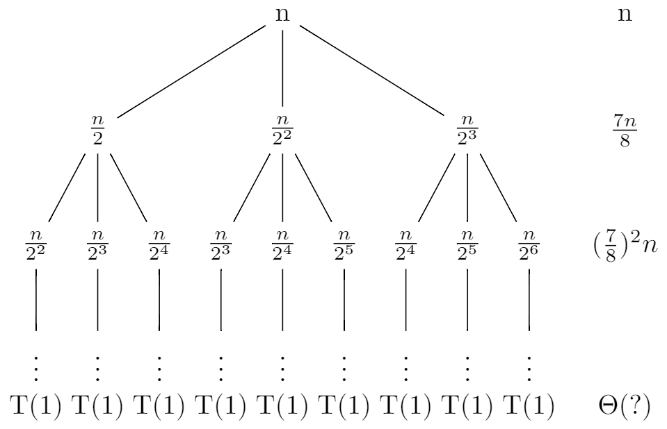
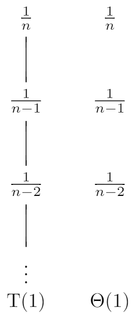
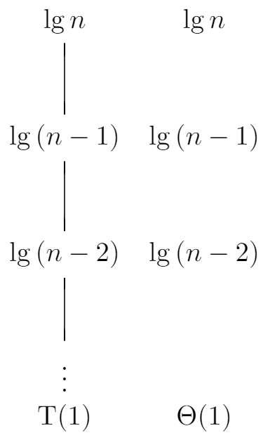
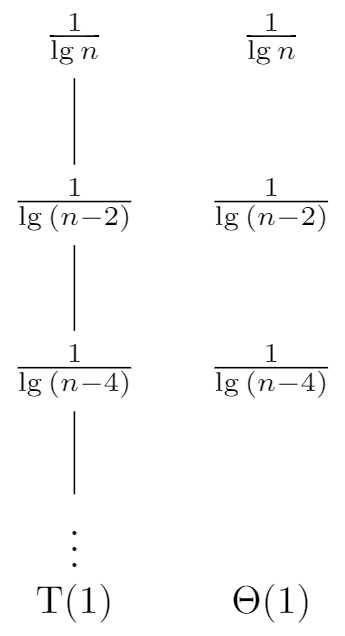

# Problems
## 4-1
### a
Here, we have a = 2, b = 2, and $f(n) = \Theta(n^4)$, and thus we have that $n^{\log_ba} = n^{\log_2{2}} = n$. Since $f(n) = \Omega(n^{\log_b{a} + \epsilon})$, where $\epsilon \leq 3$, case 3 applies. And for sufficiently large n, we have that $af(\frac{n}{b}) = 2f(\frac{n}{2}) = \frac{n^4}{8} = cf(n)$, for $c = \frac{1}{8}$. So, the solution to the recurrence is $T(n) = \Theta(n^4)$.

### b
Here, we have a = 1, $b = \frac{10}{7}$, and $f(n) = \Theta(n)$, and thus we have that $n^{\log_ba} = n^{\log_{\frac{10}{7}}{1}} = 1$. Since $f(n) = \Omega(n^{\log_b{a} + \epsilon})$, where $\epsilon \leq 1$, case 3 applies. And for sufficiently large n, we have that $af(\frac{n}{b}) = f(\frac{7n}{10}) = \frac{7n}{10} = cf(n)$, for $c = \frac{7}{10}$. So, the solution to the recurrence is $T(n) = \Theta(n)$.

### c
Here, we have a = 16, b = 4, and $f(n) = \Theta(n^2)$, and thus we have that $n^{\log_ba} = n^{\log_4{16}} = n^2$. So case 2 applies, so the solution to the recurrence is $T(n) = \Theta(n^2\lg{n})$.

### d
Here, we have a = 7, b = 3, and $f(n) = \Theta(n^2)$, and thus we have that $n^{\log_ba} = n^{\log_3{7}}$. Since $f(n) = \Omega(n^{\log_b{a} + \epsilon})$, where $\epsilon \leq 2 - \log_3{7}$, case 3 applies. And for sufficiently large n, we have that $af(\frac{n}{b}) = 7f(\frac{n}{3}) = \frac{7n^2}{9} = cf(n)$, for $c = \frac{7}{9}$. So, the solution to the recurrence is $T(n) = \Theta(n^2)$.

### e
Here, we have a = 7, b = 2, and $f(n) = \Theta(n^2)$, and thus we have that $n^{\log_ba} = n^{\log_2{7}} = n^{\lg{7}}$. Since $f(n) = O(n^{\log_b{a} - \epsilon})$, where $\epsilon \leq \lg{\frac{7}{4}}$, case 1 applies. So, the solution to the recurrence is $T(n) = \Theta(n^{\lg7})$.

### f
Here, we have a = 2, b = 4, and $f(n) = \Theta(\sqrt{n})$, and thus we have that $n^{\log_ba} = n^{\log_4{2}} = \sqrt{n}$, case 2 applies. So, the solution to the recurrence is $T(n) = \Theta(\sqrt{n}\lg{n})$.

### g
First let's create a recursion tree for the recurrence $T(n) = T(n - 2) + n^2$.

```
\documentclass{standalone}
\usepackage{tikz}
\usetikzlibrary{positioning}

\tikzset{
    no edge from this parent/.style={
        every child/.append style={
        edge from parent/.style={draw=none}}},
    level 4/.style={level distance=6mm}
}

\begin{document}
\begin{tikzpicture}

\node (root){$n^2$}
    child {node {$(n - 2)^2$}
        child {node {$(n - 4)^2$}
            child {node {$\vdots$}[no edge from this parent]
                child {node {T(1)}}}}};

\node[right=1 of root] {$n^2$}[no edge from this parent]
    child {node {$(n - 2)^2$}[no edge from this parent]
        child {node {$(n - 4)^2$}[no edge from this parent]
            child {node {}[no edge from this parent]
                child {node {$\Theta(1)$}}}}};
\end{tikzpicture}
\end{document}
```


The number of nodes at depth i is 1. And each node at depth i, for $i = 0, 1, 2, \ldots, \frac{n - 1}{2} - 1$, has a cost of $(n - 2i)^2$. So the total cost over all nodes at depth i, is $(n - 2i)^2$. The bottom level, at depth $\frac{n - 1}{2}$, has 1 node, which contributing cost T(1), for a total cost of T(1), which is $\Theta(1)$. So:

$$
\begin{eqnarray}
T(n) &=& \sum_{i = 0}^{\frac{n - 1}{2} - 1}(n - 2i)^2 + \Theta(1) \\\
&=& \sum_{i = 0}^{\frac{n - 1}{2} - 1}(n^2 - 2ni + 4i^2) + \Theta(1) \\\
&=& \sum_{i = 0}^{\frac{n - 1}{2} - 1}n^2 - \sum_{i = 0}^{\frac{n - 1}{2} - 1}2ni + \sum_{i = 0}^{\frac{n - 1}{2} - 1}4i^2 + \Theta(1) \\\
&=& \frac{n - 1}{2}n^2 - 2n\frac{(\frac{n - 1}{2} - 1)(1 + \frac{n - 1}{2} - 1)}{2} + 4\frac{(\frac{n - 1}{2} - 1)(\frac{n - 1}{2} - 1 + 1)(2(\frac{n - 1}{2} - 1) + 1)}{6} + \Theta(1) \\\
&=& \frac{n^2(n - 1)}{2} - \frac{n(n - 1)(n - 3)}{4} + \frac{(n - 1)(n - 2)(n - 3)}{6} + \Theta(1) \\\
&=& \frac{5n^3 - 6n^2 + 13n -12}{6} + \Theta(1) \\\
&=& \Theta(n^3)
\end{eqnarray}
$$

Thus, we have derived a guess of $T(n) = \Theta(n^3)$ for our original recurrence. Now let's use the substitution method to verify that our guess was correct. We want to show that $T(n) \geq c_1n^3$ and $T(n) \leq c_2n^3$ for some constants $c_1 > 0$ and $c_2 > 0$. So:

$$
\begin{eqnarray}
T(n) &=& T(n - 2) + n^2 \\\
&\geq& c_1(n - 2)^3 + n^2 \\\
&=& c_1n^3 + (1 - 6c_1)n^2 + 4c_1(3n - 2) \\\
&>& c_1n^3
\end{eqnarray}
$$

where the last step holds as long as $c_1 \leq \frac{1}{6}$.

So $T(n) = \Omega(n^3)$.

And:

$$
\begin{eqnarray}
T(n) &=& T(n - 2) + n^2 \\\
&\leq& c_2(n - 2)^3 + n^2 \\\
&=& c_2n^3 + n((1 - 6c_2)n + 12c_2) - 8c_2 \\\
&\leq& c_2n^3
\end{eqnarray}
$$

where the last step holds as long as $c_2 > \frac{1}{6}$ and $n \geq \frac{12c_2}{6c_2 - 1}$.

So $T(n) = O(n^3)$, thus $T(n) = \Theta(n^3)$.

## 4-2
### a
Here is the pseudocode of recursive binary search algorithm:

```
RECURSIVE-BINARY-SEARCH(A, v, low, high)

if low <= high
    middle = (low + high) / 2

    if A[middle] < v
        return RECURSIVE-BINARY-SEARCH(A, v, middle + 1, high)
    else if A[middle] > v
        return RECURSIVE-BINARY-SEARCH(A, v, low, middle - 1)
    else
        return middle

return NIL
```

#### An array is passed by pointer
Before it halves the problem size, it needs to do some operations like comparing `low` and `high`, calculating `middle`. But they are constant operations, we can let it be $\Theta(1)$.

So $T(n) = T(\frac{n}{2}) + \Theta(1)$. Here, we have a = 1, b = 2, and $f(n) = \Theta(1)$, and thus we have that $n^{\log_ba} = n^{\log_2{1}} = 1$. So case 2 applies, thus $T(n) = \Theta(n^{\log_ba}\lg{n}) = \Theta(\lg{n}) = \Theta(\lg{N})$.

#### An array is passed by copying
Each time it halves the problem size, it needs additional $\Theta(N)$ operation to copy the array. So $T(n) = T(\frac{n}{2}) + \Theta(N) + \Theta(1) = T(\frac{n}{2}) + \Theta(N) = T(\frac{n}{4}) + \Theta(N) + \Theta(N) = \ldots = T(1) + \lg{n}\Theta(N) = \Theta(N\lg{N})$.

#### An array is passed by range
Each time it halves the problem size, it needs additional $\Theta(n)$ operation to copy the array. So $T(n) = T(\frac{n}{2}) + \Theta(n) + \Theta(1) = T(\frac{n}{2}) + \Theta(n)$.

Here, we have a = 1, b = 2, and $f(n) = \Theta(n)$, and thus we have that $n^{\log_ba} = n^{\log_2{1}} = 1$. Since $f(n) = \Omega(n^{\log_b{a} + \epsilon})$, where $\epsilon \leq 1$, case 3 applies. And for sufficiently large n, we have that $af(\frac{n}{b}) = f(\frac{n}{2}) = \Theta(\frac{n}{2}) = c\Theta(n)$, for $c = \frac{1}{2}$. So, the solution to the recurrence is $T(n) = \Theta(n) = \Theta(N)$.

### b
Here is the pseudocode of merge sor algorithm:

```
MERGE-SORT(A, p, r)

if p < r
    q = (p + r) / 2
    MERGE-SORT(A, p ,q)
    MERGE-SORT(A, q + 1, r)
    MERGE(A, p, q, r)
```

#### An array is passed by pointer
We already know the solution that $T(n) = \Theta(n\lg{n}) = \Theta(N\lg{N})$.

#### An array is passed by copying
From the pseudocode we know it needs to pass the array 3 times to subroutine. So we have $T(n) = 2T(\frac{n}{2}) + \Theta(n) + 3\Theta(N) = 2T(\frac{n}{2}) + \Theta(n) + \Theta(N)$. Let's use the iterative method to solve it:

$$
\begin{eqnarray}
T(n) &=& 2T(\frac{n}{2}) + \Theta(n) + \Theta(N) \\\
&=& 2(2T(\frac{n}{4}) + \Theta(\frac{n}{2}) + \Theta(N)) + \Theta(n) + \Theta(N) \\\
&=& 4T(\frac{n}{4}) + 2\Theta(\frac{n}{2}) + 2\Theta(N) + \Theta(n) + \Theta(N) \\\
&=& 4T(\frac{n}{4}) + 2\Theta(n) + 3\Theta(N) \\\
&=& \ldots \\\
&=& 2^iT(\frac{n}{2^i}) + i\Theta(n) + (1 + 2 + \ldots + 2^{i - 1})\Theta(N) \text{ for } i = 1, 2, \ldots, \lg{n} \\\
&=& 2^{\lg{n}}T(1) + \lg{n}\Theta(n) + \Theta(N)\frac{1 - 2^{\lg{n}}}{1 - 2} \\\
&=& nT(1) + \Theta(n\lg{n}) + \Theta(Nn) \\\
&=& \Theta(N^2)
\end{eqnarray}
$$

#### An array is passed by range
It needs additional $3\Theta(n)$ to copy the array. So $T(n) = 2T(\frac{n}{2}) + \Theta(n) + 3\Theta(n) = 2T(\frac{n}{2}) + \Theta(n) = \Theta(n\lg{n}) = \Theta(N\lg{N})$.

## 4-3
### a
Here, we have a = 4, b = 3, and $f(n) = \Theta(n\lg{n})$, and thus we have that $n^{\log_ba} = n^{\log_3{4}}$.

In problems 3-2-a, we proved that $\lg^k{n} = O(n^\epsilon)$ for $k \geq 1$ and $\epsilon > 0$, so $\lg{n} = O(n^{\epsilon})$. Since $\log_3{4} \approx 1.2618595071429148$, so $f(n) = O(n^{\log_ba - \epsilon})$ for $\epsilon \leq 0.26$. So case 1 applies, the solution to the recurrence is $T(n) = \Theta(n^{\log_34})$.

### b
Here, we have a = 3, b = 3, and $f(n) = \Theta(\frac{n}{\lg{n}})$, and thus we have that $n^{\log_ba} = n^{\log_3{3}} = n$. So $f(n) = O(n^{\log_ba})$. But it's not that easy to prove that $f(n) = O(n^{\log_ba - \epsilon})$.

Let's solve it by iterative method:

$$
\begin{eqnarray}
T(n) &=& 3T(\frac{n}{3}) + \frac{n}{\lg{n}} \\\
&=& 3(3T(\frac{n}{9}) + \frac{\frac{n}{3}}{\lg{\frac{n}{3}}}) + \frac{n}{\lg{n}} \\\
&=& 9T(\frac{n}{9}) + \frac{n}{\lg{n} - \lg3} + \frac{n}{\lg{n}} \\\
&=& \ldots \\\
&=& 3^iT(\frac{n}{3^i}) + \sum_{i = 1}^{\log_3{n}}\frac{n}{\lg{n} - (i - 1)\lg3} \\\
&=& nT(1) + \sum_{i = 1}^{\log_3{n}}\frac{n}{\lg{n} - (i - 1)\lg3} \\\
&=& nT(1) + \sum_{i = 0}^{\log_3{n} - 1}\frac{n}{\lg{n} - i\lg3} \\\
&=& nT(1) + \sum_{i = 0}^{\log_3{n} - 1}\frac{n}{\frac{\log_3{n}}{\log_3{2}} - i\frac{\log_3{3}}{\log_3{2}}} \\\
&=& nT(1) + \log_3{2}\sum_{i = 0}^{\log_3{n} - 1}\frac{n}{\log_3{n} - i} \\\
&=& nT(1) + \log_3{2}\sum_{i = 1}^{\log_3{n}}\frac{n}{i} \\\
&=& nT(1) + \log_3{2}(n(\ln{\log_3{n}} + O(1))) \text{ by equation (A.7)} \\\
&=& \Theta(n\lg{\lg{n}})
\end{eqnarray}
$$

Thus, we have derived a guess of $T(n) = \Theta(n\lg{\lg{n}})$ for our original recurrence. Now let's use the substitution method to verify that our guess was correct. We want to show that $T(n) \geq c_1n\lg{\lg{n}}$ and $T(n) \leq c_2n\lg{\lg{n}}$ for some constants $c_1 > 0$ and $c_2 > 0$. So:

$$
\begin{eqnarray}
T(n) &=& 3T(\frac{n}{3}) + \frac{n}{\lg{n}} \\\
&\leq& 3(c_2\frac{n}{3}\lg{\lg{\frac{n}{3}}}) + \frac{n}{\lg{n}} \\\
&=& c_2n\lg{(\lg{n} - \lg3)} + \frac{n}{\lg{n}}
\end{eqnarray}
$$

It's not that easy to prove that $T(n) \leq c_2n\lg{\lg{n}}$, let's guess $T(n) \leq c_2n\lg{\lg{n}} - \frac{n}{\lg{3n}}$.

$$
\begin{eqnarray}
T(n) &=& 3T(\frac{n}{3}) + \frac{n}{\lg{n}} \\\
&\leq& 3(c_2\frac{n}{3}\lg{\lg{\frac{n}{3}}} - \frac{\frac{n}{3}}{\lg{3\frac{n}{3}}}) + \frac{n}{\lg{n}} \\\
&=& c_2n\lg{(\lg{n} - \lg3)} - \frac{n}{\lg{n}} + \frac{n}{\lg{n}} \\\
&<& c_2n\lg{\lg{n}}
\end{eqnarray}
$$

So $T(n) = O(n\lg{\lg{n}})$. And:

$$
\begin{eqnarray}
T(n) &=& 3T(\frac{n}{3}) + \frac{n}{\lg{n}} \\\
&\geq& 3(c_1\frac{n}{3}\lg{\lg{\frac{n}{3}}}) + \frac{n}{\lg{n}} \\\
&=& c_1n\lg{(\lg{n} - \lg3)} + \frac{n}{\lg{n}}
\end{eqnarray}
$$

Let's reguess $T(n) \geq c_1n\lg{\lg{3n}}$. So:

$$
\begin{eqnarray}
T(n) &=& 3T(\frac{n}{3}) + \frac{n}{\lg{n}} \\\
&\geq& 3(c_1\frac{n}{3}\lg{\lg{3\frac{n}{3}}}) + \frac{n}{\lg{n}} \\\
&=& c_1n\lg{\lg{n}} + \frac{n}{\lg{n}} \\\
&>& c_1n\lg{\lg{n}}
\end{eqnarray}
$$

So $T(n) = \Omega(n\lg{\lg{n}})$. Thus = $T(n) \ Theta(n\lg{\lg{n}})$.

### c
Here, we have a = 4, b = 2, and $f(n) = \Theta(n^2\sqrt{n})$, and thus we have that $n^{\log_ba} = n^{\log_4{2}} = \sqrt{n}$. So $f(n) = \Omega(n^{\log_ba + \epsilon})$ for $\epsilon \leq 2$. case 3 applies. And for sufficiently large n, we have that $af(\frac{n}{b}) = 4f(\frac{n}{2}) = \frac{\sqrt{2}}{2}n^2\sqrt{n} = cf(n)$, for $c = \frac{\sqrt{2}}{2}$. So, the solution to the recurrence is $T(n) = \Theta(n^2\sqrt{n})$.

### d
If n is large enough, then we can ignore the `-2`. Then we can solve it by the master method. So we have a = 3, b = 3, and $f(n) = \Theta(n)$, and thus we have that $n^{\log_ba} = n^{\log_3{3}} = n$. Case 2 applies, thus the solution to the recurrence is $T(n) = \Theta(n^{\log_ba}\lg{n}) = \Theta(n\lg{n})$.

### e
Let's try to solve a general form of the recurrence $T(n) = aT(\frac{n}{a}) + \frac{n}{\lg{n}}, a > 1$.

$$
\begin{eqnarray}
T(n) &=& aT(\frac{n}{a}) + \frac{n}{\lg{n}} \\\
&=& a(aT(\frac{n}{a^2}) + \frac{\frac{n}{a}}{\lg{\frac{n}{a}}}) + \frac{n}{\lg{n}} \\\
&=& a^2T(\frac{n}{a^2}) + \frac{n}{\lg{n} - \lg{a}} + \frac{n}{\lg{n}} \\\
&=& \ldots \\\
&=& a^iT(\frac{n}{a^i}) + \sum_{i = 1}^{\log_a{n}}\frac{n}{\lg{n} - (i - 1)\lg{a}} \\\
&=& nT(1) + \sum_{i = 1}^{\log_a{n}}\frac{n}{\lg{n} - (i - 1)\lg{a}} \\\
&=& nT(1) + \sum_{i = 0}^{\log_a{n} - 1}\frac{n}{\lg{n} - i\lg{a}} \\\
&=& nT(1) + \sum_{i = 0}^{\log_a{n} - 1}\frac{n}{\frac{\log_a{n}}{\log_a{2}} - i\frac{\log_a{a}}{\log_a{2}}} \\\
&=& nT(1) + \log_a{2}\sum_{i = 0}^{\log_a{n} - 1}\frac{n}{\log_a{n} - i} \\\
&=& nT(1) + \log_a{2}\sum_{i = 1}^{\log_a{n}}\frac{n}{i} \\\
&=& nT(1) + \log_a{2}(n(\ln{\log_a{n}} + O(1))) \text{ by equation (A.7)} \\\
&=& \Theta(n\lg{\lg{n}})
\end{eqnarray}
$$

Thus, we have derived a guess of $T(n) = \Theta(n\lg{\lg{n}})$ for our original recurrence. Now let's use the substitution method to verify that our guess was correct. We want to show that $T(n) \geq c_1n\lg{\lg{n}}$ and $T(n) \leq c_2n\lg{\lg{n}}$ for some constants $c_1 > 0$ and $c_2 > 0$. Like the problem b, let's guess $T(n) \geq c_1n\lg{\lg{an}}$ and $T(n) \leq c_2n\lg{\lg{n}} - \frac{n}{\lg{an}}$.

$$
\begin{eqnarray}
T(n) &=& aT(\frac{n}{a}) + \frac{n}{\lg{n}} \\\
&\leq& a(c_2\frac{n}{a}\lg{\lg{\frac{n}{a}}} - \frac{\frac{n}{a}}{\lg{a\frac{n}{a}}}) + \frac{n}{\lg{n}} \\\
&=& c_2n\lg{(\lg{n} - \lg{a})} - \frac{n}{\lg{n}} + \frac{n}{\lg{n}} \\\
&<& c_2n\lg{\lg{n}}
\end{eqnarray}
$$

So $T(n) = O(n\lg{\lg{n}})$. And:

$$
\begin{eqnarray}
T(n) &=& aT(\frac{n}{a}) + \frac{n}{\lg{n}} \\\
&\geq& a(c_1\frac{n}{a}\lg{\lg{a\frac{n}{a}}}) + \frac{n}{\lg{n}} \\\
&=& c_1n\lg{\lg{n}} + \frac{n}{\lg{n}} \\\
&>& c_1n\lg{\lg{n}}
\end{eqnarray}
$$

So $T(n) = \Omega(n\lg{\lg{n}})$. Thus = $T(n) = \Theta(n\lg{\lg{n}})$.

The solution to recurrence $T(n) = 2T(\frac{n}{2}) + \frac{n}{\lg{n}}$ is $\Theta(n\lg{\lg{n}})$.

### f
First let's create a recursion tree for the recurrence $T(n) = T(\frac{n}{2}) + T(\frac{n}{4}) + T(\frac{n}{8}) + n$ and assume that n is an exact power of 8.

```
\documentclass{standalone}
\usepackage{tikz}
\usetikzlibrary{positioning}

\tikzset{
    no edge from this parent/.style={
        every child/.append style={
        edge from parent/.style={draw=none}}},
    level 4/.style={level distance=6mm}
}

\begin{document}
\begin{tikzpicture}
\tikzstyle{level 1}=[sibling distance=24mm]
\tikzstyle{level 2}=[sibling distance=8mm]
\tikzstyle{level 3}=[sibling distance=4mm]

\node (root){n}
    child {node {$\frac{n}{2}$}
        child {node {$\frac{n}{2^2}$}
            child {node {$\vdots$}[no edge from this parent]
                child {node {T(1)}}}}
        child {node {$\frac{n}{2^3}$}
            child {node {$\vdots$}[no edge from this parent]
                child {node {T(1)}}}}
        child {node {$\frac{n}{2^4}$}
            child {node {$\vdots$}[no edge from this parent]
                child {node {T(1)}}}}}
    child {node {$\frac{n}{2^2}$}
        child {node {$\frac{n}{2^3}$}
            child {node {$\vdots$}[no edge from this parent]
                child {node {T(1)}}}}
        child {node {$\frac{n}{2^4}$}
            child {node {$\vdots$}[no edge from this parent]
                child {node {T(1)}}}}
        child {node {$\frac{n}{2^5}$}
            child {node {$\vdots$}[no edge from this parent]
                child {node {T(1)}}}}}
    child {node {$\frac{n}{2^3}$}
        child {node {$\frac{n}{2^4}$}
            child {node {$\vdots$}[no edge from this parent]
                child {node {T(1)}}}}
        child {node {$\frac{n}{2^5}$}
            child {node {$\vdots$}[no edge from this parent]
                child {node {T(1)}}}}
        child {node {$\frac{n}{2^6}$}
            child {node {$\vdots$}[no edge from this parent]
                child {node {T(1)}}}}};

\node[right=4 of root] {n}[no edge from this parent]
    child {node {$\frac{7n}{8}$}[no edge from this parent]
        child {node {$(\frac{7}{8})^2n$}[no edge from this parent]
            child {node {}[no edge from this parent]
                child {node {$\Theta(?)$}}}}};
\end{tikzpicture}
\end{document}
```



We've solved similar problems before. Not all branch reaches at the bottom at the same time. The right most branch reaches at the bottom first. The left most branch is the last one that reaches at the bottom.

And we can see the total cost over all nodes at depth i is $(\frac{7}{8})^in$.

If the left most branch reaches at the bottom, and assume the current depth is k, then we assume other branches reach at depth k - 1 at the same time. So we have:

$$
\begin{eqnarray}
T(n) &\leq& \sum_{i = 0}^{\lg{n} - 1}(\frac{7}{8})^in + T(1) \\\
&=& n\frac{1 - (\frac{7}{8})^{\lg{n}}}{1 - \frac{7}{8}} + T(1) \\\
&=& 8n(1 - (\frac{7}{8})^{\lg{n}}) + T(1) \\\
&<& 8n + T(1) \\\
&\leq& 9n \\\
&=& O(n)
\end{eqnarray}
$$

where the last step holds as long as $n \geq T(1)$.

Then if the right most branch reaches at the bottom, other branches have not reach at the bottom. But we assume they also reach at the bottom. So we have:

$$
\begin{eqnarray}
T(n) &\geq& \sum_{i = 0}^{\log_8{n} - 1}(\frac{7}{8})^in + (\frac{7}{8})^{\log_8{n}}n \\\
&=& n\frac{1 - (\frac{7}{8})^{\log_8{n} + 1}}{1 - \frac{7}{8}} \\\
&=& 8n(1 - (\frac{7}{8})^{\log_8{n} + 1}) \\\
&\geq& 8n(1 - (\frac{7}{8})^{\log_8{1} + 1}) \\\
&=& n \\\
&=& \Omega(n)
\end{eqnarray}
$$

Thus we devird a guess of $T(n) = \Theta(n)$ for our original recurrence. Now let's use the substitution method to verify that our guess was correct. We want to show that $T(n) \geq c_1n$ and $T(n) \leq c_2n$ for some constants $c_1 > 0$ and $c_2 > 0$. So:

$$
\begin{eqnarray}
T(n) &=& T(\frac{n}{2}) + T(\frac{n}{4}) + T(\frac{n}{8}) + n \\\
&\geq& c_1\frac{n}{2} + c_1\frac{n}{4} + c_1\frac{n}{8} + n \\\
&=& (1 + \frac{7}{8}c_1)n \\\
&\geq& c_1n \\\
&=& \Omega(n)
\end{eqnarray}
$$

where the last step holds as long as $c_1 \leq 8$.

And:

$$
\begin{eqnarray}
T(n) &=& T(\frac{n}{2}) + T(\frac{n}{4}) + T(\frac{n}{8}) + n \\\
&\leq& c_2\frac{n}{2} + c_2\frac{n}{4} + c_2\frac{n}{8} + n \\\
&=& (1 + \frac{7}{8}c_2)n \\\
&\leq& c_2n \\\
&=& O(n)
\end{eqnarray}
$$

where the last step holds as long as $c_2 \geq 8$.

Thus $T(n) = \Theta(n)$.

### g
First let's create a recursion tree for the recurrence $T(n) = T(n - 1) + \frac{1}{n}$.

```
\documentclass{standalone}
\usepackage{tikz}
\usetikzlibrary{positioning}

\tikzset{
    no edge from this parent/.style={
        every child/.append style={
        edge from parent/.style={draw=none}}},
    level 4/.style={level distance=6mm}
}

\begin{document}
\begin{tikzpicture}

\node (root){$\frac{1}{n}$}
    child {node {$\frac{1}{n - 1}$}
        child {node {$\frac{1}{n - 2}$}
            child {node {$\vdots$}[no edge from this parent]
                child {node {T(1)}}}}};

\node[right=1 of root] {$\frac{1}{n}$}[no edge from this parent]
    child {node {$\frac{1}{n - 1}$}[no edge from this parent]
        child {node {$\frac{1}{n - 2}$}[no edge from this parent]
            child {node {}[no edge from this parent]
                child {node {$\Theta(1)$}}}}};
\end{tikzpicture}
\end{document}
```



The number of nodes at depth i is 1, for $i = 0, 1, 2, \ldots, n - 2$, has a cost of $\frac{1}{n - i}$. The bottom level, at depth n - 1, has 1 node, which contribution cost T(1), for a total cost of T(1), which is $\Theta(1)$. So:

$$
\begin{eqnarray}
T(n) &=& \sum_{i = 0}^{n - 2}\frac{1}{n - i} + \Theta(1) \\\
&=& \sum_{i = 2}^{n}\frac{1}{i} + \Theta(1) \\\
&=& \ln{n} - 1 + \Theta(1) \\\
&=& \Theta(n)
\end{eqnarray}
$$

Thus, we have derived a guess of $T(n) = T(n - 1) + \frac{1}{n}$ for original recurrence. Now let's use the substitution method to verify that our guess was correct. We want to show that $T(n) \geq c_1\lg{n}$ and $T(n) \leq c_2\lg{n}$ for some constants $c_1 > 0$ and $c_2 > 0$. So:

$$
\begin{eqnarray}
T(n) &\geq& c_1\lg{(n - 1)} + \frac{1}{n}
\end{eqnarray}
$$

It's not obvious to see that $T(n) \geq c_1\lg{n}$. Let's try to guess $T(n) \geq c_1\lg{(n + 1)}$. So:

$$
\begin{eqnarray}
T(n) &\geq& c_1\lg{(n - 1 + 1)} + \frac{1}{n} \\\
&=& c_1\lg{n} + \frac{1}{n} \\\
&>& c_1\lg{n} \\\
&=& \Omega(\lg{n})
\end{eqnarray}
$$

So $T(n) = \Omega(\lg{n})$. And:

$$
\begin{eqnarray}
T(n) &\leq& c_2\lg{(n - 1)} + \frac{1}{n}
\end{eqnarray}
$$

Let's try to reguess $T(n) \leq c_2\lg{n} - \frac{1}{n + 1}$. So:

$$
\begin{eqnarray}
T(n) &\leq& c_2\lg{(n - 1)} - \frac{1}{n - 1 + 1} + \frac{1}{n} \\\
&=& c_2\lg{(n - 1)} \\\
&<& c_2\lg{n} \\\
&=& O(\lg{n})
\end{eqnarray}
$$

So $T(n) = O(\lg{n})$, thus $T(n) = \Theta(\lg{n})$.

### h
First let's create a recursion tree for the recurrence $T(n) = T(n - 1) + \lg{n}$.

```
\documentclass{standalone}
\usepackage{tikz}
\usetikzlibrary{positioning}

\tikzset{
    no edge from this parent/.style={
        every child/.append style={
        edge from parent/.style={draw=none}}},
    level 4/.style={level distance=6mm}
}

\begin{document}
\begin{tikzpicture}

\node (root){$\lg{n}$}
    child {node {$\lg{(n - 1)}$}
        child {node {$\lg{(n - 2)}$}
            child {node {$\vdots$}[no edge from this parent]
                child {node {T(1)}}}}};

\node[right=1 of root] {$\lg{n}$}[no edge from this parent]
    child {node {$\lg{(n - 1)}$}[no edge from this parent]
        child {node {$\lg{(n - 2)}$}[no edge from this parent]
            child {node {}[no edge from this parent]
                child {node {$\Theta(1)$}}}}};
\end{tikzpicture}
\end{document}
```



The number of nodes at depth i is 1, for $i = 0, 1, 2, \ldots, n - 2$, has a cost of $\lg({n - i})$. The bottom level, at depth n - 1, has 1 node, which contribution cost T(1), for a total cost of T(1), which is $\Theta(1)$. So:

$$
\begin{eqnarray}
T(n) &=& \sum_{i = 0}^{n - 2}\lg{(n - i)} + \Theta(1) \\\
&=& \sum_{i = 2}^{n}\lg{n} + \Theta(1) \\\
&=& \lg{(n!)} + \Theta(1) \\\
&=& \Theta(n\lg{n}) \text{ (we have proved it in 3.2-3)}
\end{eqnarray}
$$

Thus, we have derived a guess of $T(n) = T(n - 1) + \lg{n}$ for original recurrence. Now let's use the substitution method to verify that our guess was correct. We want to show that $T(n) \geq c_1n\lg{n}$ and $T(n) \leq c_2n\lg{n}$ for some constants $c_1 > 0$ and $c_2 > 0$. So:

$$
\begin{eqnarray}
T(n) &\geq& c_1(n - 1)\lg{(n - 1)} + \lg{n}
\end{eqnarray}
$$

Let's try to reguess $T(n) \geq c_1(n + 1)\lg{(n + 1)}$. So:

$$
\begin{eqnarray}
T(n) &\geq& c_1(n - 1 + 1)\lg{(n - 1 + 1)} + \lg{n} \\\
&=& c_1n\lg{n} + \lg{n} \\\
&>& c_1n\lg{n} \\\
&=& \Omega(n\lg{n})
\end{eqnarray}
$$

So $T(n) = \Omega(n\lg{n})$. And:

$$
\begin{eqnarray}
T(n) &\leq& c_2(n - 1)\lg{(n - 1)} + \lg{n} \\\
&<& c_2(n - 1)\lg{n} + \lg{n} \\\
&=& \lg{n}(c_2(n - 1) + 1) \\\
&\leq& c_2n\lg{n} \\\
&=& O(n\lg{n})
\end{eqnarray}
$$

where the last step holds as long as $c_2 \geq 1$.

So $T(n) = O(n\lg{n})$. Thus $T(n) = \Theta(n\lg{n})$.

### i
First let's create a recursion tree for the recurrence $T(n) = T(n - 2) + \frac{1}{\lg{n}}$.

```
\documentclass{standalone}
\usepackage{tikz}
\usetikzlibrary{positioning}

\tikzset{
    no edge from this parent/.style={
        every child/.append style={
        edge from parent/.style={draw=none}}},
    level 4/.style={level distance=6mm}
}

\begin{document}
\begin{tikzpicture}

\node (root){$\frac{1}{\lg{n}}$}
    child {node {$\frac{1}{\lg{(n - 2)}}$}
        child {node {$\frac{1}{\lg{(n - 4)}}$}
            child {node {$\vdots$}[no edge from this parent]
                child {node {T(1)}}}}};

\node[right=1 of root] {$\frac{1}{\lg{n}}$}[no edge from this parent]
    child {node {$\frac{1}{\lg{(n - 2)}}$}[no edge from this parent]
        child {node {$\frac{1}{\lg{(n - 4)}}$}[no edge from this parent]
            child {node {}[no edge from this parent]
                child {node {$\Theta(1)$}}}}};
\end{tikzpicture}
\end{document}
```



The number of nodes at depth i is 1, for $i = 0, 1, 2, \ldots, \lg{(n - 1)} - 1$, has a cost of $\frac{1}{\lg{(n - 2^i)}}$. The bottom level, at depth $\lg{(n - 1)}$, has 1 node, which contribution cost T(1), for a total cost of T(1), which is $\Theta(1)$. So:

$$
\begin{eqnarray}
T(n) &=& \sum_{i = 0}^{\lg{(n - 1)} - 1}\frac{1}{\lg{(n - 2^i)}} + \Theta(1)
\end{eqnarray}
$$

But I don't know how to compute the sum.

### j
Let's solve it by the iterative method and assume n is an exact power of 2, and n is also a perfect square.

$$
\begin{eqnarray}
T(n) &=& \sqrt{n}T(\sqrt{n}) + n \\\
&=& n^{\frac{1}{2}}T(n^{\frac{1}{2}}) + n \\\
&=& n^{\frac{1}{2}}((n^{\frac{1}{2}})^{\frac{1}{2}}T((n^{\frac{1}{2}})^{\frac{1}{2}}) + n^{\frac{1}{2}}) + n \\\
&=& n^{\frac{1}{2}}(n^{\frac{1}{4}}T(n^{\frac{1}{4}}) + n^{\frac{1}{2}}) + n \\\
&=& n^{\frac{1}{2} + \frac{1}{4}}T(n^{\frac{1}{4}}) + n^{\frac{1}{2} + \frac{1}{2}} + n \\\
&=& n^{\frac{1}{2} + \frac{1}{4}}(n^{\frac{1}{8}}T(n^{\frac{1}{8}}) + n^{\frac{1}{4}}) + n^{\frac{1}{2} + \frac{1}{2}} + n \\\
&=& n^{\frac{1}{2} + \frac{1}{4} + \frac{1}{8}}T(n^{\frac{1}{8}}) + n^{\frac{1}{2} + \frac{1}{4} + \frac{1}{4}} + n^{\frac{1}{2} + \frac{1}{2}} + n \\\
&=& \ldots \\\
&=& n^{\sum_{i = 1}^{\lg{\sqrt{n}}}\frac{1}{2^i}}T(2) + \lg{\sqrt{n}} * n \\\
&<& n^{\sum_{i = 1}^{\infty}\frac{1}{2^i}}T(2) + \lg{\sqrt{n}} * n \\\
&=& n^{\frac{\frac{1}{2}}{1 - \frac{1}{2}}}T(2) + \frac{1}{2}n\lg{n} \\\
&=& nT(2) + \frac{1}{2}n\lg{n} \\\
&=& O(n\lg{n})
\end{eqnarray}
$$

Thus, we have derived a guess of $T(n) = O(n\lg{n})$ for original recurrence. Now let's use the substitution method to verify that our guess was correct. We want to show that $T(n) \leq cn\lg{n}$ for some constant c > 0. So:

$$
\begin{eqnarray}
T(n) &=& \sqrt{n}T(\sqrt{n}) + n \\\
&\leq& \sqrt{n}c\sqrt{n}\lg{\sqrt{n}} + n \\\
&=& cn\lg{\sqrt{n}} + n \\\
&=& \frac{1}{2}cn\lg{n} + n
\end{eqnarray}
$$

Because $\frac{1}{2}cn\lg{n} + n - cn\lg{n} = n(1 - \frac{1}{2}c\lg{n}) \leq n(1 - \frac{1}{2}c)$ when $n \geq 2$. So $n(1 - \frac{1}{2}c) \leq 0$ when $c \geq 2$. So $T(n) \leq cn\lg{n}$ when $c \geq 2$ and $n \geq 2$. Thus, $T(n) = O(n\lg{n})$.

But I don't know how to get the lower bound.

## 4-4
