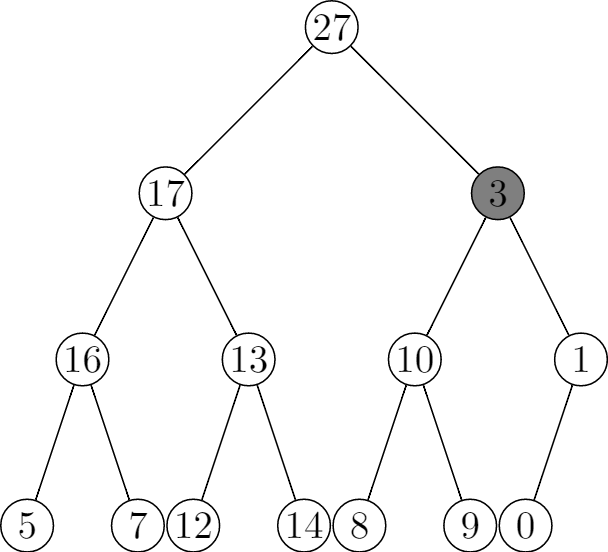
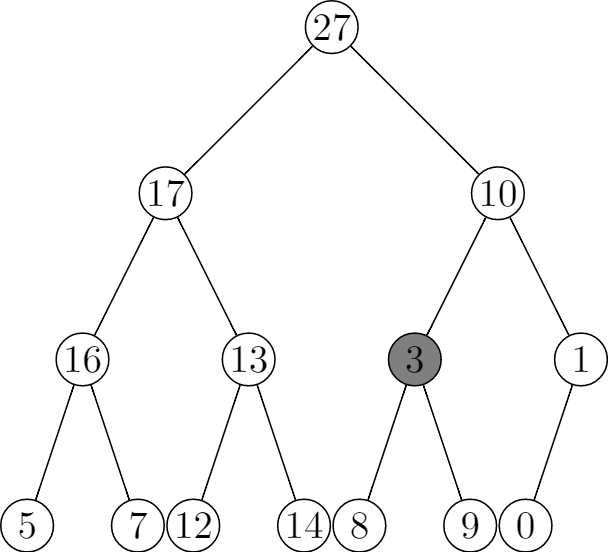
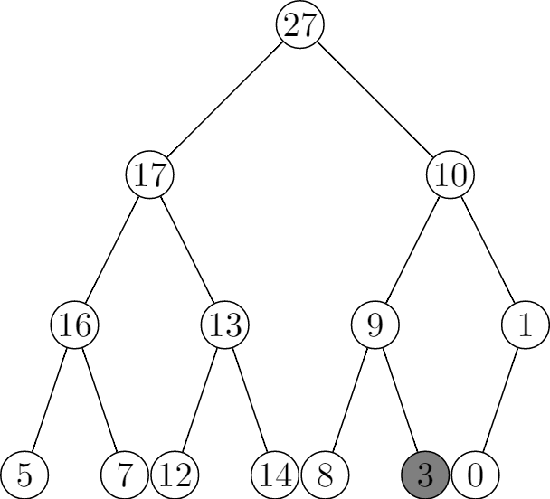

# 6.2 Maintaining the heap property
## 6.2-1






## 6.2-2
```
MIN-HEAPIFY(A, i)
l = LEFT(i)
r = RIGHT(i)
if l <= A.heap-size and A[l] < A[i]
    min = l
else
    min = i
if r <= A.heap-size and A[r] < A[min]
    min = r
if min != i
    exchange A[i] with A[min]
    MIN-HEAPIFY(A, min)
```

The running time is still $O(\lg{n})$.

## 6.2-3
The procedure terminates and the running time is O(1).

## 6.2-4
In exercise 6.1-7 we know the leaves are the nodes indexed by $\lfloor \frac{n}{2} \rfloor + 1, \ldots$, thus if i > A.heap-size / 2, then the node at index i is a leaf, so both l <= A.heap-size and r <= A.heap-size fail, the procedure terminates.

## 6.2-5
```
MAX-HEAPIFY(A, i)
largest = -1
root = i
while largest != root
    l = LEFT(root)
    r = RIGHT(root)
    if l <= A.heap-size and A[l] > A[root]
        largest = l
    else
        largest = root
    if r <= A.heap-size and A[r] > A[largest]
        largest = r
    if largest != root:
        exchange A[root] with A[largest]
        root = largest
        largest = -1
```

## 6.2-6
The worst-case happens when it checks every node from the root down to a leaf. And the height h is $\lfloor \lg{n} \rfloor \geq \lg{n}$, so the worst-case running time is $\Omega(\lg{n})$.