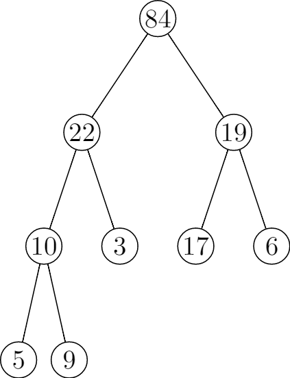

# 6.3 Building a heap
## 6.3-1
```
\documentclass{standalone}
\usepackage{tikz}

\begin{document}
\begin{tikzpicture}[level/.style={sibling distance=20mm/#1},
treenode/.style={align=center, inner sep=0pt, text width=1.2em, text centered},
current/.style={fill=gray}]
    \node [circle,draw,treenode] {5}
      child {
        node [circle,draw,treenode] {3}
        child {
            node [circle,draw,treenode,current] {10}
            child {
                node [circle,draw,treenode] {22}
            }
            child {
                node [circle,draw,treenode] {9}
            }}
        child {
            node [circle,draw,treenode] {84}
        }
      }
      child {
        node [circle,draw,treenode] {17}
        child {
            node [circle,draw,treenode] {19}
        }
        child {
            node [circle,draw,treenode]  {6}
        }
    };
    \end{tikzpicture}
\end{document}
```




## 6.3-2
If we loop the index in a increasing order, when we call MAX-HEAPIFY(A, i), it's possible that the left subtree at root 2i and the right subtree at root 2i + 1 are not max-heap.

## 6.3-3
