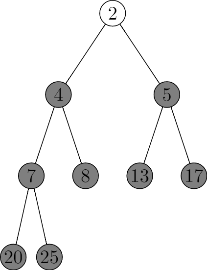

# 6.4 The heapsort algorithm
## 6.4-1
```
\documentclass{standalone}
\usepackage{tikz}

\begin{document}
\begin{tikzpicture}[level/.style={sibling distance=20mm/#1},
treenode/.style={align=center, inner sep=0pt, text width=1.2em, text centered},
current/.style={fill=gray}]
    \node [circle,draw,treenode] {5}
      child {
        node [circle,draw,treenode] {13}
        child {
            node [circle,draw,treenode] {25}
            child {
                node [circle,draw,treenode] {8}
            }
            child {
                node [circle,draw,treenode] {4}
            }}
        child {
            node [circle,draw,treenode] {7}
        }
      }
      child {
        node [circle,draw,treenode] {2}
        child {
            node [circle,draw,treenode] {17}
        }
        child {
            node [circle,draw,treenode]  {20}
        }
    };
    \end{tikzpicture}
\end{document}
```




## 6.4-2
