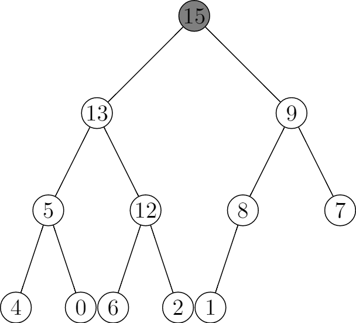
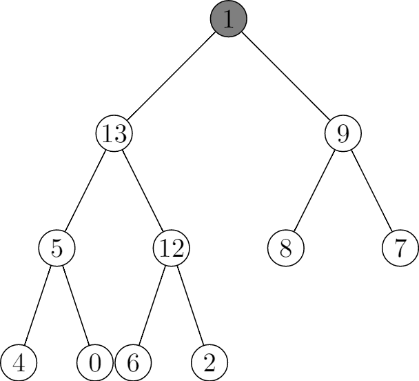
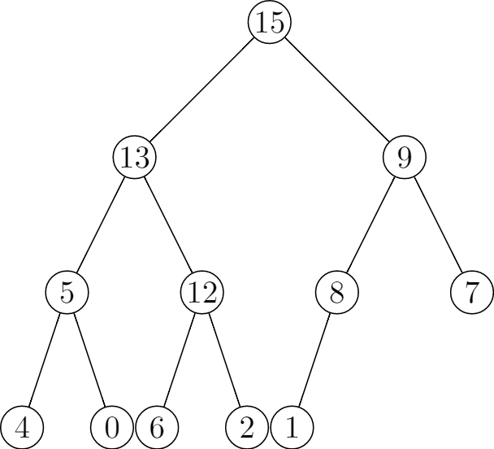
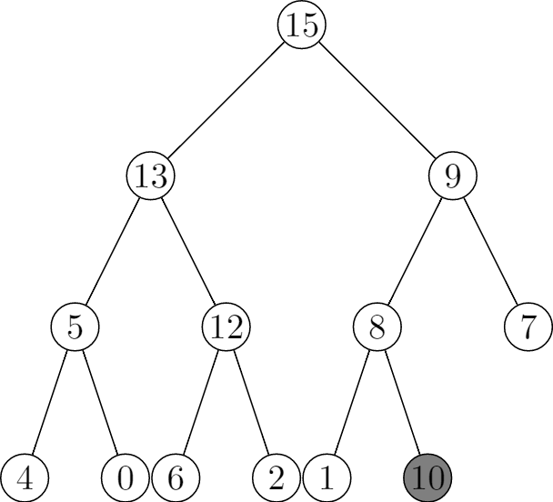
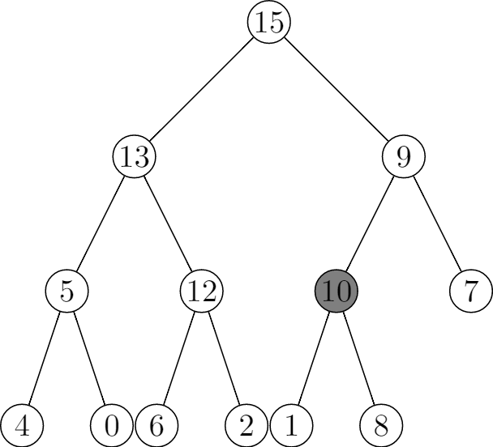
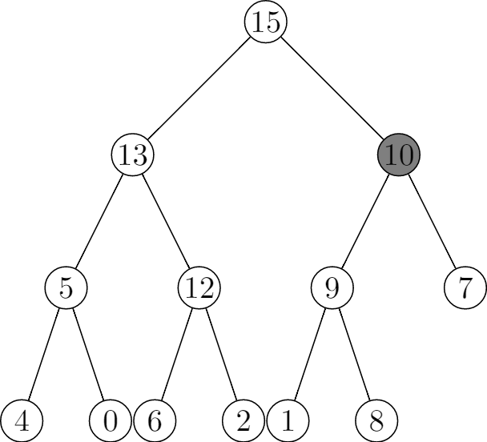

# 6.5 Priority queues
## 6.5-1
```
\documentclass{standalone}
\usepackage{tikz}

\begin{document}
\begin{tikzpicture}[level/.style={sibling distance=30mm/#1},
treenode/.style={align=center, inner sep=0pt, text width=1.2em, text centered},
current/.style={fill=gray}]
    \node [circle,draw,treenode,current] {15}
      child {
        node [circle,draw,treenode] {13}
        child {
            node [circle,draw,treenode] {5}
            child {
                node [circle,draw,treenode] {4}
            }
            child {
                node [circle,draw,treenode] {0}
            }}
        child {
            node [circle,draw,treenode] {12}
            child {
                node [circle,draw,treenode] {6}
            }
            child {
                node [circle,draw,treenode] {2}
            }
        }
      }
      child {
        node [circle,draw,treenode] {9}
        child {
            node [circle,draw,treenode] {8}
            child {
                node [circle,draw,treenode] {1}
            }
            child [missing] {}
        }
        child {
            node [circle,draw,treenode]  {7}
        }
    };
    \end{tikzpicture}
\end{document}
```






## 6.5-2
```
\documentclass{standalone}
\usepackage{tikz}

\begin{document}
\begin{tikzpicture}[level/.style={sibling distance=30mm/#1},
treenode/.style={align=center, inner sep=0pt, text width=1.2em, text centered},
current/.style={fill=gray}]
    \node [circle,draw,treenode] {15}
      child {
        node [circle,draw,treenode] {13}
        child {
            node [circle,draw,treenode] {5}
            child {
                node [circle,draw,treenode] {4}
            }
            child {
                node [circle,draw,treenode] {0}
            }}
        child {
            node [circle,draw,treenode] {12}
            child {
                node [circle,draw,treenode] {6}
            }
            child {
                node [circle,draw,treenode] {2}
            }
        }
      }
      child {
        node [circle,draw,treenode] {9}
        child {
            node [circle,draw,treenode] {8}
            child {
                node [circle,draw,treenode] {1}
            }
            child [missing] {}
        }
        child {
            node [circle,draw,treenode]  {7}
        }
    };
    \end{tikzpicture}
\end{document}
```









## 6.5-3
```
HEAP-MINIMUM(A)
    return A[1]
```

```
HEAP-EXTRACT-MIN(A)
    if A.heap-size < 1
        error "heap underflow"
    min = A[1]
    A[1] = A[A.heap-size]
    A.heap-size = A.heap-size - 1
    MIN-HEAPIFY(A, 1)
    return max
```

```
HEAP-DECREASE-KEY(A, i, key)
    if key > A[i]
        error "new key is bigger than current key"
    A[i] = key
    while i > 1 and A[PARENT(i)] > A[i]
        exchange A[i] with A[PARENT(i)]
        i = PARENT(i)
```

```
MIN-HEAP-INSERT(A, key)
    A.heap-size = A.heap-size + 1
    A[A.heap-size] = +∞
    HEAP-DECREASE-KEY(A, A.heap-size, key)
```

## 6.5-4
Setting the key of the inserted node to negative infinity to make sure it can pass the truth check in line 1 of `HEAP-INCREASE-KEY(A, i, key)`.

## 6.5-5
**Initialization**: Prior to the first iteration of the loop, the subarray `A[1..A.heap-size]` is satifies the max-heap before we set `A[i] = key`, after we set `A[i] = key`, it's possible that `A[i]` would be greater than its parent. And we cannot set a smaller key to `A[i]`, so there may be only one violation.

**Maintenance**: In the for loop, we are exchanging `A[i]` and `A[PARENT(i)]`, before the exchange, the subtree rooted at `A[i]` is a max-heap, but it may be greater than its parent, so there may be on violation.

**Termination**: When it's terminated, i maybe 1 or `A[i]` is smaller thant its parent, either makes A a max-heap.

## 6.5-6
```
HEAP-INCREASE-KEY(A, i, key)
if key < A[i]
    error "new key is smaller than current key"
while i > 1 and A[PARENT(i)] < key
    A[i] = A[PARENT(i)]
    i = PARENT(i)
A[i] = key
```

## 6.5-7
Implement a first-in, first-out queue with a min priority queue. Call `MIN-HEAP-INSERT` method to enqueue with a priority, for example, use timestamp as priority. Call `HEAP-MINIMUM` to dequeue.

Implement a stack with a max priority queue. Call `MAX-HEAP-INSERT` method to push with a priority, for example, use timestamp as priority. Call `HEAP-MAXIMUM` to pop.


## 6.5-8
```
HEAP-DELETE(A, i)
A.heap-size < 1
    error "heap underflow"
A[i] = A[A.heap-size]
A.heap-size = A.heap-size - 1
MAX-HEAPIFY(A, i)
```

## 6.5-9
First we create a k-elements min heap from the first element in each sorted list, this requires $O(k) + O(n) = O(n)$.

Then we keep extracting the min value from min heap, and insert the next value after the min value in the original list, this requires $O(\lg{k})$. And there are n elements, so it requires $O(n\lg{k})$.

Thus the running time is $O(n) + O(n\lg{k}) = O(n\lg{k})$.

```py
def merge_sorted_lists(lists):
    sorted_list = []
    min_heap_elements = []

    for i in range(len(lists)):
        min_heap_elements.append(MinHeapElement(i, 1, lists[i][0]))

    min_heap = MinHeap(min_heap_elements)

    while not min_heap.is_empty():
        min_element = min_heap.extract_min()
        sorted_list.append(min_element.value)

        list_index = min_element.list_index
        next_index = min_element.next_index

        if next_index < len(lists[list_index]):
            next_element = MinHeapElement(
                list_index, next_index + 1, lists[list_index][next_index])

            min_heap.insert(next_element)

    return sorted_list


class MinHeapElement():
    def __init__(self, list_index, next_index, value):
        self.list_index = list_index
        self.next_index = next_index
        self.value = value


class MinHeap():
    def __init__(self, elements):
        self.elements = elements
        self.heap_size = len(elements)

        self.build_min_heap()

    def extract_min(self):
        assert not self.is_empty()

        minimum = self.elements[0]
        self.elements[0] = self.elements[self.heap_size - 1]
        self.heap_size -= 1

        self.min_heapify(0)

        return minimum

    def insert(self, element):
        self.heap_size += 1

        if len(self.elements) < self.heap_size:
            self.elements.append(element)
        else:
            self.elements[self.heap_size - 1] = element

        self.decrease_element(self.heap_size - 1, element)

    def decrease_element(self, i, element):
        assert i < self.heap_size
        assert element.value <= self.elements[i].value

        while i > 0 and self.elements[(i - 1) // 2].value > element.value:
            self.elements[i] = self.elements[(i - 1) // 2]
            i = (i - 1) // 2

        self.elements[i] = element

    def is_empty(self):
        return self.heap_size == 0

    def min_heapify(self, i):
        left = 2 * i + 1
        right = 2 * i + 2
        minimum = i

        if (left <= self.heap_size - 1 and
                self.elements[left].value < self.elements[i].value):
            minimum = left

        if (right <= self.heap_size - 1 and
                self.elements[right].value < self.elements[minimum].value):
            minimum = right

        if minimum != i:
            self.elements[i], self.elements[minimum] = \
                self.elements[minimum], self.elements[i]

            self.min_heapify(minimum)

    def build_min_heap(self):
        for i in range((self.heap_size - 1) // 2, -1, -1):
            self.min_heapify(i)
```