# 7.1 Description of quicksort
## 7.1-1
```
\documentclass{standalone}

\usepackage{colortbl}
\makeatletter
\newcolumntype{W}{!{\smash{\vrule
\@width 4\arrayrulewidth
\@height\dimexpr\ht\@arstrutbox+2pt\relax
\@depth\dimexpr\dp\@arstrutbox+2pt\relax}}}
\makeatother
\definecolor{gray}{rgb}{.5,.5,.5}
\definecolor{lightgray}{rgb}{.8,.8,.8}
\begin{document}
\begin{tabular}{c|c|cWc|cWc|c|c|c|c|c|cWc|}
\multicolumn{1}{c}{}&
\multicolumn{1}{c}{$p$}&
\multicolumn{1}{c}{$i$}&
\multicolumn{1}{c}{}&
\multicolumn{1}{c}{}&
\multicolumn{1}{c}{$j$}&
\multicolumn{1}{c}{}&
\multicolumn{1}{c}{}&
\multicolumn{1}{c}{}&
\multicolumn{1}{c}{}&
\multicolumn{1}{c}{}&
\multicolumn{1}{c}{}&
\multicolumn{1}{c}{$r$}\\
&
\cellcolor{lightgray}9&
\cellcolor{lightgray}5&
\cellcolor{gray}13&
\cellcolor{gray}19&
12&
8&
7&
4&
21&
2&
6&
11
\end{tabular}
\end{document}
```

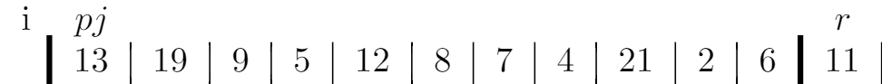

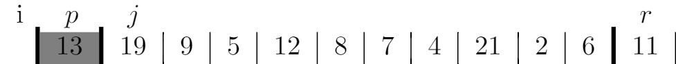

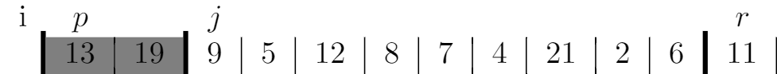

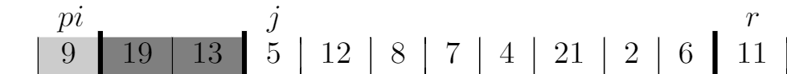

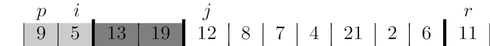

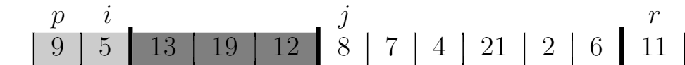

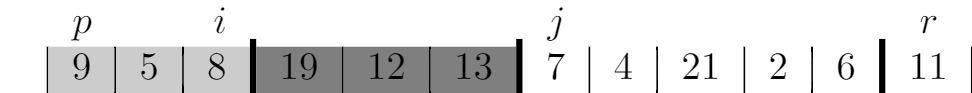

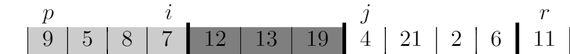

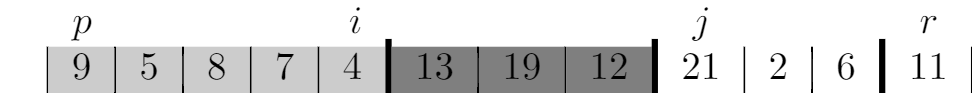

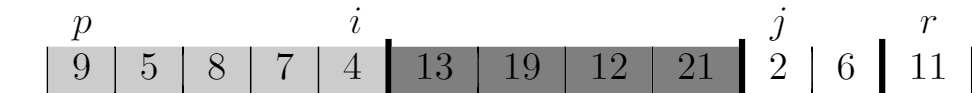

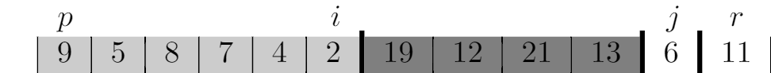

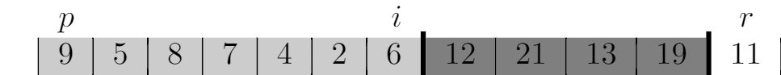

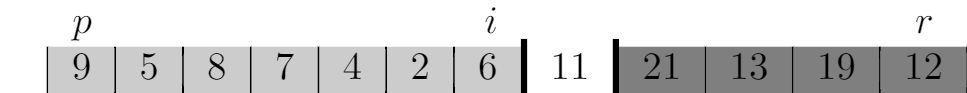

## 7.1-2
