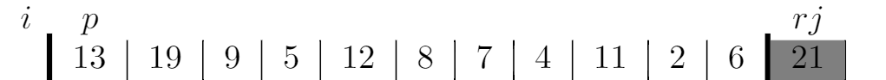
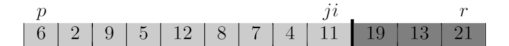

# Problems
## 7-1
### a
```
\documentclass{standalone}

\usepackage{colortbl}
\makeatletter
\newcolumntype{W}{!{\smash{\vrule
\@width 4\arrayrulewidth
\@height\dimexpr\ht\@arstrutbox+2pt\relax
\@depth\dimexpr\dp\@arstrutbox+2pt\relax}}}
\makeatother
\definecolor{gray}{rgb}{.5,.5,.5}
\definecolor{lightgray}{rgb}{.8,.8,.8}
\begin{document}
\begin{tabular}{c|c|c|c|c|c|c|c|c|cWc|c|c|c}
\multicolumn{1}{c}{}&
\multicolumn{1}{c}{$p$}&
\multicolumn{1}{c}{}&
\multicolumn{1}{c}{}&
\multicolumn{1}{c}{}&
\multicolumn{1}{c}{}&
\multicolumn{1}{c}{}&
\multicolumn{1}{c}{}&
\multicolumn{1}{c}{}&
\multicolumn{1}{c}{$ji$}&
\multicolumn{1}{c}{}&
\multicolumn{1}{c}{}&
\multicolumn{1}{c}{$r$}&
\multicolumn{1}{c}{}\\
&
\cellcolor{lightgray}6&
\cellcolor{lightgray}2&
\cellcolor{lightgray}9&
\cellcolor{lightgray}5&
\cellcolor{lightgray}12&
\cellcolor{lightgray}8&
\cellcolor{lightgray}7&
\cellcolor{lightgray}4&
\cellcolor{lightgray}11&
\cellcolor{gray}19&
\cellcolor{gray}13&
\cellcolor{gray}21&
\end{tabular}
\end{document}
```







### b
We repeat `j = j - 1` from `r + 1` and repeat `i = i + 1` from `p - 1`, so `i` moves from left to right and `j` moves from right to left, the while loop terminates when `i >= j`, thus, it will not access an element of A outside the subarray `A[p..r]`. But will it keep increasing `i` such that `i` is bigger than `r`? No, it's not possible, because we choose `A[p]` as pivot. So in the first iteration, `i` stops at `p`, and if `i < j`, we exchange `A[i]` with `A[j]`, so the pivot is exchanged to right, thus it makes sure it stops keep increasing `i` when it meets the pivot in right.

### c
Suppose the array is in increasing order, so it keeps increasing `j` until `j = p` because `A[p] <= x`. So `j` could be `p`. In the while loop, `j` will be `r` first, because there are at least two elements in the array, it will keep increasing `j` or exchange `A[i]` with `A[j]`, if it increase `j`, we get `j < r`, if we exchange `A[i]` with `A[j]`, then it also increase `j` in the next iteration, either makes `j > r`. So `p <= j < r`.

### d
`j` stopes decreasing when `A[j] <= x` and `i` stops increasing when `A[i] >= x`, after exchanging `A[i]` with `A[j]`, it makes sure every element of `A[p..i]` is less than or equal to every element of `A[j..r]`. When it terminates, we have `j - i <= 1`, so every element of `A[p..j]` is less than or equal to every element of `A[j + 1..r]`.


### e
```
QUICKSORT(A, p, r)
if p < r
    q = HOARE-PARTITION(A, p, r)
    QUICKSORT(A, p, q)
    QUICKSORT(A, q + 1, r)

HOARE-PARTITION(A, p, r)
x = A[p]
i = p - 1
j = r + 1
while True
    repeat
        j = j - 1
    until A[j] <= x
    repeat
        i = i + 1
    until A[i] >= x
    if i < j
        exchange A[i] with A[j]
    else return j
```

## 7-2
### a
If all elements values are equal, then randomize the array won't make a difference. In exercise 7.2-2 we know the running time is $\Theta(n^2)$.

### b
```
PARTITION'(A, p, r)
x = A[r]
i = p - 1
t = p - 1
for j = p to r - 1
    if A[j] <= x
        t = t + 1
        i = i + 1
        exchange A[t] with A[i]

        if t != j:
            exchange A[j] with A[i]
    else if A[j] == x
        t = t + 1
        exchange A[t] with A[j]
exchange A[t + 1] with A[r]
return i + 1, t + 1
```

The running time is obviously $\Theta(r - p)$.

### c
```
RANDOMIZED-QUICKSORT'(A, p, r)
if p < r
    q, t = RANDOMIZED-PARTITION'(A, p r)
    RANDOMIZED-QUICKSORT'(A, p, q - 1)
    RANDOMIZED-QUICKSORT'(A, t + 1, r)

RANDOMIZED-PARTITION'(A, p, r)
i = RANDOM(p, r)
exchange A[r] with A[i]
return PARTITION'(A, p, r)
```

```
QUICKSORT'(A, p, r)
if p < r
    q, t = RANDOMIZED-PARTITION'(A, p r)
    QUICKSORT'(A, p, q - 1)
    QUICKSORT'(A, t + 1, r)
```

### d
If we use `QUICKSORT'`, then the worst-case becomes a best-case. If all elements of the array are the same, then the `PARTITION'` on the whole array splits the problem size to `[p, p - 1]` and `[r + 1, r]`, then the subproblem terminates. The running time is $\Theta(n)$.

So we can avoid the assumption that all elements are distinct, because if an array with size n contains duplicate elements, the running time is less than the running time of the array with distinct elements.

## 7-3
### a
We choose the last element as pivot, but we randomize the array before that. It has the probability $\frac{1}{n}$ that an element will be put to the last position in array. So any particular element is chosen as the pivot is $\frac{1}{n}$. And $E[X_i] = \frac{1}{n}$.

### b
First let's check the expected running time when element i is chosen as pivot. The `PARTITION` method takes $\Theta(n)$, and the problem size is splited to `[p, i - 1]` and `[i + 1, r]`, the running time of the two subproblems are $T(i - 1 - p + 1) = T(i - p)$ and $T(r - (i + 1) + 1) = T(r - i)$. Thus the running time is $E[X_i(T(i - p) + T(r - i) + \Theta(n))]$, where p = 1, r = n.

Thus $E[T(n)] = E[\sum_{q = 1}^n X_q(T(q - 1) + T(n - q) + \Theta(n))]$.

### c
$$
\begin{eqnarray}
E[T(n)] &=& E[\sum_{q = 1}^n X_q(T(q - 1) + T(n - q) + \Theta(n))] \\\
&=& E[\sum_{q = 1}^n \frac{1}{n}(T(q - 1) + T(n - q) + \Theta(n))] \\\
&=& \frac{1}{n}E[T(0) + T(n - 1) + \Theta(n) + T(1) + T(n - 2) + \Theta(n) + \ldots + T(n - 1) + T(0) + \Theta(n)] \\\
&=& \frac{1}{n}E[(T(0) + T(1) + \ldots + T(n - 1)) + (T(n - 1) + T(n - 2) + \ldots + T(0)) + n\Theta(n)] \\\
&=& \frac{1}{n}E[2\sum_{q = 0}^{n - 1}T(q) + n\Theta(n)] \\\
&=& \frac{2}{n}E[\sum_{q = 0}^{n - 1}T(q)] + \Theta(n) \\\
&=& \frac{2}{n}\sum_{q = 0}^{n - 1}E[T(q)] + \Theta(n) \\\
&=& \frac{2}{n}\sum_{q = 2}^{n - 1}E[T(q)] + \frac{2}{n}(E[T(0)] + E[T(1)]) + \Theta(n) \\\
&=& \frac{2}{n}\sum_{q = 2}^{n - 1}E[T(q)] + \Theta(n)
\end{eqnarray}
$$

### d
$$
\begin{eqnarray}
\sum_{k = 2}^{n - 1} k\lg{k} &=& \sum_{k = 2}^{\lceil \frac{n}{2} \rceil - 1} k\lg{k} + \sum_{k = \lceil \frac{n}{2} \rceil}^{n - 1} k\lg{k} \\\
&<& \sum_{k = 2}^{\frac{n}{2} + 1 - 1} k\lg{k} + \sum_{k = \frac{n}{2}}^{n - 1} k\lg{k} \\\
&=& \sum_{k = 2}^{\frac{n}{2}} k\lg{k} + \sum_{k = \frac{n}{2}}^{n - 1} k\lg{k} \\\
&\leq& \sum_{k = 2}^{\frac{n}{2}} k\lg{\frac{n}{2}} + \sum_{k = \frac{n}{2}}^{n - 1} k\lg{n} \\\
&=& (\lg{n} - 1)\frac{(2 + \frac{n}{2})(\frac{n}{2} - 2 + 1)}{2} + \lg{n}\frac{(\frac{n}{2} + n - 1)(n - 1 - \frac{n}{2} + 1)}{2} \\\
&=& (\lg{n} - 1)(\frac{n^2}{8} + \frac{n}{4} - 1) + \lg{n}(\frac{3n^2}{8} - \frac{n}{4}) \\\
&=& \frac{1}{2}n^2\lg{n} - \frac{1}{8}n^2 -\lg{n} - \frac{n}{4} + 1 \\\
&<=& \frac{1}{2}n^2\lg{n} - \frac{1}{8}n^2 - \lg3 - \frac{3}{4} + 1 \\\
&<& \frac{1}{2}n^2\lg{n} - \frac{1}{8}n^2
\end{eqnarray}
$$

### e
We stary by assuming that $E[T(n)] \leq an\lg{n}$ for all positive m < n, yielding $E[T(q)] \leq aq\lg{q}$. Substituting into the equation:

$$
\begin{eqnarray}
E[T(n)]&=& \frac{2}{n}\sum_{q = 2}^{n - 1}E[T(q)] + \Theta(n) \\\
&\leq& \frac{2}{n}\sum_{q = 2}^{n - 1} aq\lg{q} + \Theta(n) \\\
&=& \frac{2a}{n}\sum_{q = 2}^{n - 1} q\lg{q} + \Theta(n) \\\
&\leq& \frac{2a}{n}(\frac{1}{2}n^2\lg{n} - \frac{1}{8}n^2) + \Theta(n) \\\
&=& an\lg{n} - \frac{a}{4}n + \Theta(n) \\\
&\leq& an\lg{n} - \frac{a}{4}n + cn \\\
&=& an\lg{n} - (\frac{a}{4} - c)n \\\
&\leq& an\lg{n}
\end{eqnarray}
$$

where the last step holds as long as $\frac{a}{4} \geq c$.

Thus $E[T(n)] = \Theta(n\lg{n})$.

## 7-4
### a
