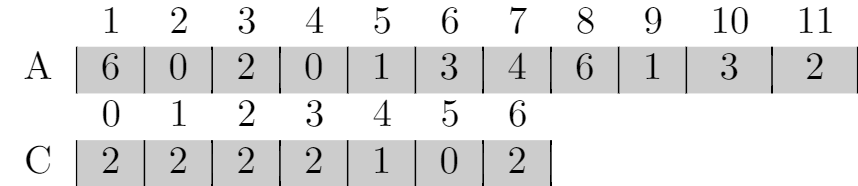
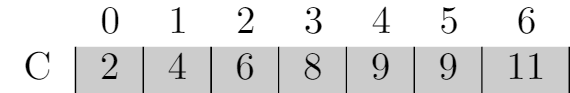
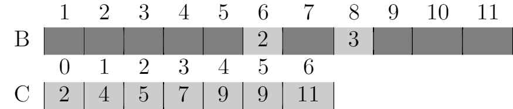

# 8.2 Counting sort
## 8.2-1
```
\documentclass{standalone}

\usepackage{colortbl}
\makeatletter
\newcolumntype{W}{!{\smash{\vrule
\@width 4\arrayrulewidth
\@height\dimexpr\ht\@arstrutbox+2pt\relax
\@depth\dimexpr\dp\@arstrutbox+2pt\relax}}}
\makeatother
\definecolor{gray}{rgb}{.5,.5,.5}
\definecolor{lightgray}{rgb}{.8,.8,.8}
\begin{document}
\begin{tabular}{c|c|c|c|c|c|c|c|c|c|c|c|}
\multicolumn{1}{c}{}&
\multicolumn{1}{c}{1}&
\multicolumn{1}{c}{2}&
\multicolumn{1}{c}{3}&
\multicolumn{1}{c}{4}&
\multicolumn{1}{c}{5}&
\multicolumn{1}{c}{6}&
\multicolumn{1}{c}{7}&
\multicolumn{1}{c}{8}&
\multicolumn{1}{c}{9}&
\multicolumn{1}{c}{10}&
\multicolumn{1}{c}{11}\\
B&
\cellcolor{lightgray}0&
\cellcolor{lightgray}0&
\cellcolor{lightgray}1&
\cellcolor{lightgray}1&
\cellcolor{lightgray}2&
\cellcolor{lightgray}2&
\cellcolor{lightgray}3&
\cellcolor{lightgray}3&
\cellcolor{lightgray}4&
\cellcolor{lightgray}6&
\cellcolor{lightgray}6\\
\multicolumn{1}{c}{}&
\multicolumn{1}{c}{0}&
\multicolumn{1}{c}{1}&
\multicolumn{1}{c}{2}&
\multicolumn{1}{c}{3}&
\multicolumn{1}{c}{4}&
\multicolumn{1}{c}{5}&
\multicolumn{1}{c}{6}\\
C&
\cellcolor{lightgray}0&
\cellcolor{lightgray}2&
\cellcolor{lightgray}4&
\cellcolor{lightgray}6&
\cellcolor{lightgray}8&
\cellcolor{lightgray}9&
\cellcolor{lightgray}9
\end{tabular}
\end{document}
```









## 8.2-2
Suppose for two indices i < j, we have A[i] = A[j]. And we scan A from n to 1, so we met A[j] first, and then we put A[j] in B and subtract 1 from C[A[j]], so when we met A[i], it will be put before A[j], so the numbers with the same value appear in the output array in the same order as they do in the input array, `COUNTING-SORT` is stable.

## 8.2-3
The new algorithm works properly because it only affects the output of the elements that have same value, the relative order of distinct elements is not affected.

But the algorithm is not stable, because the numbers with the same value appear in the output array in the opposite order now.

## 8.2-4
We can reuse the code from line 1 to 8 in `COUNTING-SORT`. C[i] contains the number of elements less than or equal to i, so the number of elements fall into the range [a..b] is `C[b] - C[a - 1]`. We assume `C[i] = 0` when i is negative.

```
PREPROCESS(A, k)
let C[0..k] be a new array
for i = 0 to k
    C[i] = 0
for j = 1 to A.length
    C[A[j]] = C[A[j]] + 1
for i = 1 to k
    C[i] = C[i] + C[i - 1]

QUERY(a, b)
if a - 1 < 0
    return C[b]
return C[b] - C[a - 1]
```