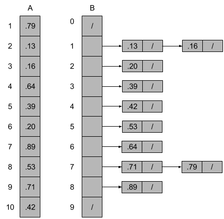

# 8.4 Bucket sort
## 8.4-1

## 8.4-2
The worst-case can happen when it takes too long to sort list `B[i]`. Because the worst-case running time of insertion sort is $\Theta(n^2)$, if for a given `B[i]`, which happens to contain all elements, then the insertion sort takes $\Theta(n^2)$, thus the worst-case running time becomes $\Theta(n^2)$.

We can use another sort algorithm to sort `B[i]`, for example, the mergesort algorithm.

## 8.4-3
We have:

$$
\begin{eqnarray}
X &=& I\lbrace\text{the number of heads in two flips of a fair coin}\rbrace \\\
&=& \begin{cases}
      0 \\\
      1 \\\
      2 \\\
    \end{cases}
\end{eqnarray}
$$

And $Pr\lbrace \text{the number of heads in two flips is } 0\rbrace = \frac{1}{4}$, $Pr\lbrace \text{the number of heads in two flips is } 1\rbrace = \frac{1}{2}$, $Pr\lbrace\text{the number of heads in two flips is } 2\rbrace = \frac{1}{4}$.

So $E[X] = 0 * \frac{1}{4} + 1 * \frac{1}{2} + 2 * \frac{1}{4} = 1$. Thus $E[X^2] = 0^2 * \frac{1}{4} + 1^2 * \frac{1}{2} + 2^2 * \frac{1}{4} = \frac{3}{2}$, $(E[X])^2 = 1$.

## 8.4-4
